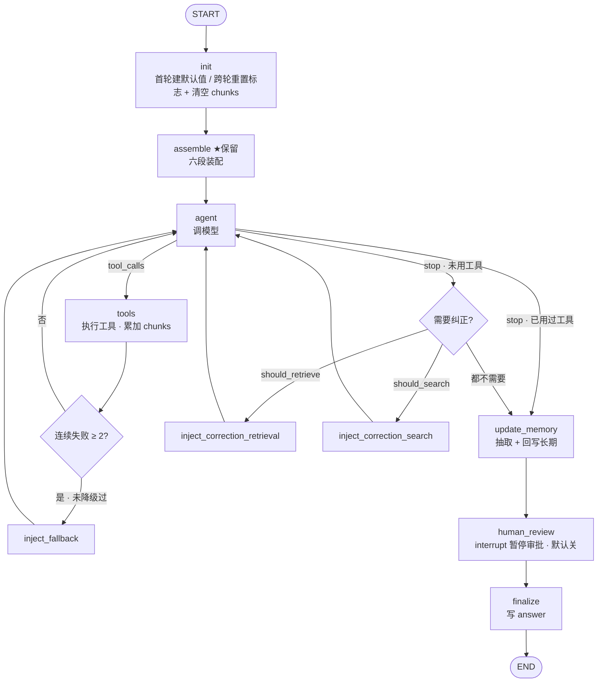

# 第六周设计草稿：用 LangGraph 重写 search_agent

> 状态：**定稿 v0.4**（v0.3 基础上落地决策 E：长期记忆迁 LangGraph Store——§3.3 的 B/C 岔路按 SqliteStore 新证据改判为**选 C**，已实现为 v4.1 并验证"召回不退化 + 持久化生效"，见 [Store迁移验证记录](Store迁移验证记录.md)）
> 基线：`search_agent v3.0`（week_4&5）　目标：`v4.0`（状态化工作流）
> 本文不含实现代码——代码是周四的事，本文产出的是**决策 + 状态图**。
>
> **v0.2 → v0.3 变更**（源自 E2 唯一意外发现）：TypedDict 字段**无隐式默认值**——`init` 节点职责从"跨轮重置"升级为"跨轮重置 + **首轮建立默认值**"（§1 决策 C、§2.2、决策定稿表 C 行）；新增实现约束"条件边读 per-query 标志一律 `state.get(k, 默认)`"。其余设计与 v0.2 一致，仅补验证状态标注。

---

## 〇、本周目标与范围（决策 A 已定）

**roadmap 目标**：第一个状态化 Agent 工作流 + 一张自画的 Agent 状态图。

**范围**：本周只把**控制流 + 短期状态**迁到 LangGraph（`StateGraph` + `checkpointer`）；**长期记忆（`memory/long_term` + 整个 `rag/`）保持原样**，从节点里照旧调用，`Store` 迁移**推迟到控制流 + 状态跑通之后单独做**（见 §3.3 决策 E）。

理由：本周学习焦点是"状态图 + 检查点"，不是重写存储层。两件事分开做，blast radius 最小——graph 跑通后，存储层照旧复用 E2c 验证过的"共用向量库 + 分 namespace"。

---

## 一、State schema（设计问题 ①）

把 v3.0 里散落的状态（`run_agent` 的局部变量 + trace 字段 + 装配产物）收进一个 `TypedDict`。

| 字段 | 类型 | 合并方式 | 对应 v3.0 | 说明 |
|---|---|---|---|---|
| `messages` | `Annotated[list, add_messages]` | **累加** | `agent.py` 的 messages | 工作消息流：装配出的初始 messages、工具结果、纠正/降级消息都追加进来 |
| `user_message` | `str` | 替换 | `run_agent` 入参 | 本轮问题；`checks` 和 `assembler` 都读它 |
| `retrieved_chunks` | `list[dict]` | 替换（累加在节点内手动做） | retrieve 成功后存进 trace 的 chunk 元信息 | **轮内累加**：`tools` 节点返回"当前+新"；`init` 返回 `[]` 清空（决策 B/C） |
| `has_searched` | `bool` | 替换 | `agent.py` 分支2 | 是否调过 `web_search`（含失败="尝试过"，防反复纠正） |
| `has_retrieved` | `bool` | 替换 | `agent.py` 分支2 | 是否调过 `retrieve_documents` |
| `retrieval_correction_injected` | `bool` | 替换 | 分支1 防护限制 | 检索纠正最多一次 |
| `search_correction_injected` | `bool` | 替换 | 分支1 防护限制 | 联网纠正最多一次 |
| `fallback_injected` | `bool` | 替换 | 检查机制2 防护限制 | 降级最多一次 |
| `consecutive_failures` | `int` | 替换（节点内 +1/清零） | 检查机制2 | 工具连续失败计数，成功清零 |
| `turn_count` | `int` | 替换（节点内 +1） | `for turn in range(MAX_TURNS)` | 循环上限保护（`MAX_TURNS=6`） |
| `assembly_report` | `dict \| None` | 替换 | `AssemblyReport` | segments_present / trimmed / total_chars / facts_recalled，可观测 |
| `correction_triggered` | `bool` | 替换 | trace 语义字段 | 你想保留的 trace 标注 |
| `fallback_triggered` | `bool` | 替换 | trace 语义字段 | 同上 |
| `answer` | `str` | 替换 | `run_agent` 返回值 | 最终回答 |

**关于 reducer 的判断**：图基本是**顺序**的（没有并行分支同时写同一字段），所以**唯一的 reducer 就是 `messages` 的 `add_messages`，其余全部默认替换**。计数器也用替换（节点内读当前值、返回 +1）。

**`retrieved_chunks` 的特殊处理（决策 B + C）**：它要在**一个用户问题内累加**（纠正会触发多次检索），但**仍用替换语义**——累加在 `tools` 节点里手动做：检索成功时返回"当前 + 新 chunk"，没检索就不返回这个键（保持不变）；`init` 节点返回 `[]` 清空。**刻意不给它上 `operator.add` reducer**——否则 `init` 想用 `return []` 清空会变成"追加一个空列表"的无效操作（带累加 reducer 的字段没法直接重置，是个常见坑）。这样既实现了"轮内累加 + 跨问题清空"，又保住了"只有 messages 用 reducer"的简洁。

**per-query 标志的重置（决策 C，v0.3 扩充）**：`has_*`、`*_injected`、`consecutive_failures`、`turn_count` 在 v3.0 里是 `run_agent` 的局部变量、每次调用天然清零。加 `checkpointer` 后 state 跨轮持久化，不重置就会串到下个问题。解法：开头的 **`init` 节点**显式重置这些标志（连带把 `retrieved_chunks` 清空）。这就是踩坑 #2"时序"思维的图上版本——从隐式依赖函数调用边界，变成图入口的显式重置。

**E2 实测修正（v0.3 新增）**：TypedDict 的字段**没有隐式默认值**——无 `init` 的图第一轮里 `has_retrieved` 是 `None` 而不是 `False`（裸取 `state["has_retrieved"]` 直接 KeyError）。E2 对照组实测 agent 两轮看到的值是 `[None, True]`：第一轮根本没有默认值，第二轮才是泄漏。所以 `init` 的职责是**双重的**：

1. **首轮**：为所有 per-query 字段建立默认值（否则下游裸取就崩，这一条 v0.2 没假设到）；
2. **后续轮**：把上一问题的残留打回初值（v0.2 的原假设）。

两件事恰好是同一段代码（`init` 返回全套初值），但**必要性来自两个不同的事实**——`init` 节点比 v0.2 假设的更不可省。配套实现约束：条件边读 per-query 标志一律 `state.get(k, 默认)` 防御性取值，不依赖"`init` 一定先跑过"；`init` **不返回 `messages` 键**（返回了就会动持久化历史——E2 验证的关键不对称：不返回 = 保留，返回初值 = 重置）。

---

## 二、节点切分（设计问题 ②，本周最核心）

**规则**：节点 = 干活 / 改 state；边 = 做路由决策（读 state 决定去哪，不改 state）。

### 2.1 把第三周自己设想的"节点"重新归类

第三周复盘里列了 7 个"节点"。用上面这条规则过一遍，**其中三个其实是条件边**：

| 第三周设想的"节点" | 实际归类 | 为什么 |
|---|---|---|
| `route`（判 finish_reason） | **条件边** | 纯决策，不改 state |
| `execute_tools` | 节点 ✓ | 干活：调工具、把结果写进 messages |
| `check_should_search` | **条件边** | 纯决策：读 `user_message` + `has_*` 返回去向 |
| `inject_correction` | 节点 ✓ | 干活：把纠正消息追加进 messages |
| `check_consecutive_errors` | **条件边** | 纯决策：读 `consecutive_failures` |
| `inject_fallback` | 节点 ✓ | 干活：追加降级消息 |
| `return_answer` | 节点 ✓（或直接接 END） | 收尾：写 `answer` |

这就是周一问题②的答案核心：**"检查"几乎都是边，"注入/执行/收尾"才是节点**。

### 2.2 最终节点清单（work）

| 节点 | 对应 v3.0 代码 | 干的活 |
|---|---|---|
| `init` | （新增）`run_agent` 局部变量初始化 | **首轮为所有 per-query 字段建立默认值**（E2 实测：TypedDict 无隐式默认，v0.3 新增职责）+ 后续轮重置本轮 per-query 标志（`has_*` / `*_injected` / `consecutive_failures` / `turn_count`）+ 清空 `retrieved_chunks`；**不返回 `messages` 键**（保留持久化历史） |
| `assemble` ★保留 | `memory.assemble_context()` / `assembler.py` | 六段装配，产出初始 messages + `assembly_report` |
| `agent` | `client.chat.completions.create(...)` | 调模型，写回 assistant 消息 |
| `tools` | `execute_tool()` / `tools.py` | 执行工具，写结果 + 更新 `has_*` / 累加 `retrieved_chunks` / `consecutive_failures` |
| `inject_correction_retrieval` | `agent.py` 分支1 检索纠正 | 追加 `RETRIEVAL_CORRECTION_MESSAGE`，置 `retrieval_correction_injected=True` |
| `inject_correction_search` | `agent.py` 分支1 联网纠正 | 追加 `CORRECTION_MESSAGE`，置 `search_correction_injected=True` |
| `inject_fallback` | 检查机制2 注入逻辑 | 追加降级消息，置 `fallback_injected=True` |
| `update_memory` | `memory.update_from_turn()` / `extractor` + `summarizer` | 抽取主题/偏好/事实、写长期、eviction 触发摘要 |
| `human_review` | （新增）interrupt 点 | `finalize` 前的输出审批，节点内调 `interrupt()`；`INTERRUPT_ENABLED` 默认关（决策 F，见 §4） |
| `finalize` | `run_agent` 返回 | 写 `answer`，收尾 |

**决策 D**：纠正拆成 `inject_correction_retrieval` 和 `inject_correction_search` 两个节点，但**共用同一个函数体**（如 `functools.partial(inject_correction, kind="retrieval")`）——图上是两条可见路径、把"检索优先、联网其次"的优先级记在图里，代码不重复。

### 2.3 最终条件边清单（decision）

- **`agent` 之后 `route_by_finish`**：`finish=="tool_calls"` → `tools`；`finish=="stop"` → 进 `need_correction` 判定。
- **`need_correction`**（复刻分支1"只在从未用过工具时才纠正"）：
  - 若 `has_searched or has_retrieved` → 直接 `update_memory`（尊重模型的 stop）
  - 否则 `should_have_retrieved(user_message)` 且未注入过 → `inject_correction_retrieval`
  - 否则 `should_have_searched(user_message)` 且未注入过 → `inject_correction_search`
  - 都不满足 → `update_memory`
- **`tools` 之后 `check_failures`**：`consecutive_failures >= 2` 且未降级过 → `inject_fallback`；否则 → 回 `agent`。
- **回连**：`inject_correction_retrieval` / `inject_correction_search` / `inject_fallback` → 回 `agent`（cycle，取代 v3.0 的 `continue`）。
- **循环上限**：每条回到 `agent` 的边先查 `turn_count < MAX_TURNS`，超了直接 → `finalize`。LangGraph 的 `recursion_limit` 作兜底，但保留 `turn_count` 显式语义。

> 注：v3.0"无状态检查先过滤、有状态检查再确认"在这里天然分层——无状态判断进条件边函数，有状态确认就是读 state 里的 `has_*`。两道检查的组合结构原样保留。

---

## 三、框架边界 + 存储（设计问题 ③）

### 3.1 归属（迁移表的浓缩结论）

- **交给框架**：持久化（六 json + 两向量库的手动 save / `load_snapshot` 全消失）、跨轮加载、时序物理落点 → `checkpointer`。
- **你保留**：六段装配的"挑选"逻辑（`assemble` 节点）、规则抽取（`update_memory` 节点）、纠正/降级"分什么支"。
- **基本不变**：`rag/` 整条管线、`config.py`、`experiments.py`。

### 3.2 短期 vs 长期，本周怎么落

- **短期（最近 K 轮）**：持久化交给 `checkpointer`；**双闸门裁剪（K 轮 + 字符预算）仍留在 `assemble` 节点**——LangGraph 不替你裁，它只存全量。
- **长期（偏好/事实/主题）**：本周**保持 `memory/long_term` + `rag/` 原样**，在 `assemble` 里读、在 `update_memory` 里写。

### 3.3 记忆事实存储（决策 E：v0.3 时选 A 推迟；v0.4 落地，B/C 岔路改判选 C）

| 选项 | 做法 | 利 | 弊 | 状态 |
|---|---|---|---|---|
| A 推迟 | 长期记忆不动，照旧用 `rag/store.py` | blast radius 最小；E2c 共用向量库 + namespace 原样保留；本周专注 graph+checkpoint | 没体验到 LangGraph `Store` | ✅ v4.0 时选定，已完成使命 |
| B 包一层 | 自己的库包成 LangGraph `BaseStore` | 完整留住 E2c 共用向量库 | 大半精力花在实现 `BaseStore` 抽象方法（plumbing），绕过了 Store 本身 | ❌ 落选 |
| **C 原生 Store（SqliteStore）** | 三类长期记忆进 `SqliteStore`，facts 配语义索引（embed 复用 text-embedding-v3） | 标准 Store API + 本地 `.db` 持久化白拿；两个手动 embed call site 消失；下标对齐的手工同步消失 | E2c 失"共用向量库"（保"共用 embedding 模型"） | **✅ v4.1 选定并落地** |

**v0.2 → v0.4 的改判依据**：v0.2 把 C 判为"只有内存版、要拆 E2c"，新证据推翻了前提——
`langgraph-checkpoint-sqlite` 的 **SqliteStore 提供本地文件级持久化 + 语义搜索**，不需要 Postgres。
决策 E 的初衷就是体验真实的 LangGraph Store，C 学到的是标准 API；B 学到的是 plumbing。

**落地结果（v4.1，2026-06-05）**：三 namespace =
`("ltm","preferences")` / `("ltm","facts")`（语义索引 `fields=["fact"]`）/ `("ltm","topics")`；
prefs/topics 写入 `index=False`（语义索引只给 facts）；checkpointer 管 thread 内短期状态、
store 管跨 thread 长期记忆的边界落进 `graph.compile(checkpointer=..., store=...)`；
"挑选"常量（top_k / min_score / 段预算）留在自己这侧。
迁移验证：召回 hit@1/hit@3 均 12/12 → 12/12 无退化，重启进程数据还在，
详见 [Store迁移验证记录](Store迁移验证记录.md)。

---

## 四、interrupt 位置（设计问题 ④，决策 F 已定）

**诚实定位**：这个 agent 是只读的研究/问答型——不发邮件、不写库、无不可逆动作。所以 `human_review` 本周**是学习/演示性质，不是生产刚需**。

**决策 F**：在 `update_memory` 之后、`finalize` 之前放一个 **`human_review` 节点**（节点内调 `interrupt()`），让人在回答返回前查看/改写。用 `config` 开关 `INTERRUPT_ENABLED`，**默认关**——测试和批量评测时关掉以保证可复现（沿用"记忆可插拔、测试不带记忆"的同款思路）。

**为什么放 `finalize` 前而不是纠正点前**：输出审批是 HITL 最标准的形态，一个问题**恰好触发一次**；只读 agent 上唯一值得真人过目的就是最终答案，拦在又便宜又无害的检索前纯属添活。

**它真正变刚需在第七周以后**：planner-executor / 多 agent 引入**写工具**时，同一个 `interrupt` 机制会挪到"不可逆动作执行前"。本周这次是合适的彩排，"在收不回的那一步前先暂停"的结构性教训到时原样能用。（也呼应第三周留的 Q3：多 agent 场景控制流在哪一层生效。）

---

## 五、状态图（定稿）

**图外补充（不画进去免得乱）：**

- 所有回到 `agent` 的边都隐含一道 `turn_count < MAX_TURNS` 闸门，超限直接走 `finalize`。
- `checkpointer` 包住**整张图**（`compile(checkpointer=...)`），每个节点后存一份快照，按 `thread_id` 归档——多轮对话靠它续上。
- `human_review` 是个节点（非分支）：`INTERRUPT_ENABLED=False` 时透明放行，`True` 时在此 `interrupt()` 暂停、等人 `Command(resume=...)` 后进 `finalize`。
- 长期记忆（本周保持 `rag/` 原样）的**读**在 `assemble`、**写**在 `update_memory`——写在读的下游，所以"本轮写入的偏好/事实，本轮装配读不到、下一轮才生效"，与 v3.0 行为一致（E5 第2轮"偏好刚设置、本轮还没进"那条）。要不要改成本轮可见是另一个设计选择，本周不动。

---

## 六、周三验证清单（v0.3：已于 2026-06-04 实跑验证，详见 [实验结论](../experiment/实验结论.md)）

1. ✅ **E1** State schema 用 `add_messages` 单 reducer + 其余替换，跑最小三节点图（`assemble → agent → finalize`）正常传状态（2/2 判据过）。
2. ✅ **E2** `init` 重置标志 + 清空 `retrieved_chunks`，配合 checkpointer 持久化，做到"跨轮记 messages 历史、但 per-query 状态清零"（3/3 判据过；决策 C 坐实）。**意外发现**：TypedDict 无隐式默认值 → `init` 还负责首轮建默认值，已并入 §1/§2。
3. ✅ **E3** `retrieved_chunks` 在 `tools` 节点手动"当前+新"累加、`init` 返回 `[]` 清空（3/3 判据过；决策 B 坐实）。对照组实证：`operator.add` 字段 `return []` 是 no-op、清不掉——"不给 chunks 上 reducer"从推理变实证。
4. ✅ **E4** 纠正 cycle 与 `turn_count` 闸门配合不死循环，停在 `MAX_TURNS=6`；对照组无闸门如期抛 `GraphRecursionError`（2/2 判据过）——框架 `recursion_limit` 只能当兜底，正常终止必须靠自己的闸门。
5. ✅ **E5** `human_review` 节点内 `interrupt()`，`INTERRUPT_ENABLED=False` 完全透明、`True` 时暂停在 `('human_review',)` 并可 `Command(resume=)` 跑完（3/3 判据过；决策 F 坐实）。
6. ⏸️（可选项，未做，不挡主线）LangGraph `Store` 的语义索引召回质量 vs E2c 的 namespace 方案——留作日后 Store 迁移（决策 E 的 B/C 选项）的攒证据项。

---

## 决策定稿

| # | 决策点 | 定稿 |
|---|---|---|
| A | 本周迁移范围 | 只迁控制流 + 短期状态（graph + checkpointer）；长期记忆与 `rag/` 保持原样，`Store` 迁移推迟 |
| B | `retrieved_chunks` 合并 | 轮内累加（`tools` 节点手动"当前+新"）+ `init` 返回 `[]` 清空 |
| C | per-query 标志重置 | 入口 `init` 节点显式重置（含 `retrieved_chunks` 清空）；**v0.3 扩充：首轮同时为所有 per-query 字段建立默认值**（E2 实测 TypedDict 无隐式默认）；条件边读标志一律 `state.get(k, 默认)` |
| D | 纠正注入节点数 | 拆两个节点（检索/联网），共用一个函数体 |
| E | 记忆事实存储 | ~~推迟（Option A）~~ → **v0.4 已落地选 C**：三类长期记忆迁 SqliteStore（v4.1），召回不退化 + 持久化生效 |
| F | `human_review` 位置 | `finalize` 前，节点内 `interrupt()`，`INTERRUPT_ENABLED` 默认关 |

---

*定稿 v0.4，2026-06-05。基于 search_agent v3.0；E1–E5 验证完毕（13/13 判据，LangGraph 1.2.4），v4.0 已实现；决策 E 落地为 v4.1。*
*版本记录：v0.2（2026-06-02，周二设计日定稿）→ v0.3（2026-06-04，并入 E2 意外发现：`init` 增加"首轮建默认值"职责 + `state.get()` 实现约束 + 验证清单标注结果）→ v0.4（2026-06-05，决策 E 落地：§3.3 B/C 岔路按 SqliteStore 新证据改判选 C，v4.1 实现并验证）。*
