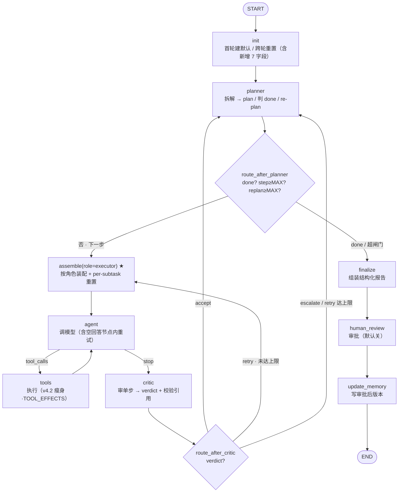

# 第七周设计草稿：planner-executor 技术调研 Agent

> 状态：**v0.2**（周三 E1–E5 已实跑，13/13 判据全过；详见 [实验结论](../experiment/实验结论.md)）
> 基线：`search_agent v4.2`（week_6）　目标：`v5.0`（多步骤任务规划 / 技术调研 Agent）
> 本文不含实现代码——代码是周四的事，本文产出的是**决策 + 状态图**。
> 设计前提全部来自已锁定的 [规划器与执行器职责边界](规划器与执行器职责边界.md)；本文把那份"概念表态"翻成"可施工蓝图"。
>
> **v0.1 → v0.2 变更**（源自 E1–E5 实测，2026-06-08）：本周机制大多是第六周已验证机制的**降一层复用**，实测**无推翻假设的意外**，七个决策中 A/B/D/E/G 获实证。并入三处精确化：① `route_after_critic` 逻辑三路、物理上塌缩成**两条边**，`add_conditional_edges` mapping 只需 `{planner, executor}`（E1，§2.3）；② 外层双闸门**非冗余**、各兜一个正交维度，实测 escalate 恒压下 `replan_count` 闸门**先收口**，坐实 `MAX_REPLAN=2` 是 re-plan 环的有效断路器（E4，§2.3 / 决策 D）；③ 新增 7 字段**必须全部写进 State schema**（尤其 `critic_verdict`），schema 外字段的更新会被框架静默丢弃（E5，§一 / §三）。其余设计与 v0.1 一致，仅补验证状态标注。

---

## 〇、本周目标与范围（决策 A 已定）

**roadmap 目标**：多步骤任务规划——planner-executor / decomposition / reflection-critic / 终止与回滚；实战做技术调研 Agent（输入问题 → 出研究计划 → 分步检索总结 → 结构化报告）。

**范围**：在 v4.2 基线上**只加一个外层 plan 循环 + 两个新节点（`planner` / `critic`）**；v4.2 的单步执行引擎（`agent ↔ tools ↔ inject_*` 内层循环）、收尾三连（`finalize → human_review → update_memory`）、Store / RAG 全部**原样复用**。

**关键认识：本周是给 v4.2 套一层外循环，不是重写。** v4.2 已有的是"单问题、单答案"的内层 tool-use 循环（`turn_count` 闸门）。v5.0 在它外面包一层"多子任务"的 plan 循环（`step_index` / `replan_count` 闸门）。两层循环各有独立闸门、互不串扰——这条决定了下面几乎所有设计取舍。

理由：blast radius 最小。v4.2 刚把"第七周前重构五项"落地（tools 瘦身、收尾时序反转、空回答重试、判据重审、引用契约收紧），这些正是外循环要踩的地基，本周不该再动它们，只在其上叠加。

---

## 一、State schema 新增（设计问题 ①）

在 v4.2 `AgentState` 上**新增 7 个字段**，全部沿用 v4.2 既定纪律：除 `messages` 外一律替换语义；需累加的在节点内手动做、不上 reducer。

| 字段 | 类型 | 合并方式 | 谁写 | 说明 |
|---|---|---|---|---|
| `plan` | `list[dict]`（SubTask） | 替换 | planner | 有序子任务列表，每项 `{id, query, status}`；re-plan 时整表替换 |
| `step_index` | `int` | 替换（节点内推进） | planner / edge | 当前执行到第几个子任务；外循环闸门读它 |
| `step_results` | `list[dict]` | **替换（累加在节点内手动做）** | executor | 每步结论 `{step_id, text, citations, status}`；**轮内累加 + init 清空**，照搬 `retrieved_chunks` 先例 |
| `critic_verdict` | `Literal["accept","retry","escalate"]` | 替换 | critic | 单步裁决；critic 后的条件边读它分流 |
| `retry_count` | `int` | 替换（节点内 +1/清零） | critic / step 转移 | **业务层**重试计数（换措辞重做该步）；**与 v4.2 的 `empty_retries` 是两个计数器，不要混**（见 §三） |
| `replan_count` | `int` | 替换（节点内 +1） | planner | re-plan 次数，外循环防绕圈闸门读它 |
| `done` / `termination_reason` | `bool` / `str` | 替换 | planner | planner 判"调研够了"写 `done`，**实际终止由条件边读**（节点干活、边做决策） |

**reducer 判断（不变）**：图仍是顺序的（外循环也是单线，没有并行分支同时写一个字段），所以**唯一 reducer 仍是 `messages` 的 `add_messages`**。`step_results` 要累加，但**刻意不上 `operator.add`**——否则 step 转移想清空就变成"追加空列表"的 no-op（v4.2 `retrieved_chunks` 已踩实这个坑，E3 坐实）。累加在 executor 节点内"当前 + 新"手动做。

**重置职责升级：per-query → per-subtask（本周最容易漏的一处）。** v4.2 的 `init` 把 per-query 标志（`has_*` / `turn_count` / `consecutive_failures` / `*_injected` / `empty_retries`）每问题清零一次。v5.0 里这些是**内层（单子任务）**状态，必须**每个子任务都清零**，否则上一个子任务"已检索过"会让下一个子任务被错误地跳过纠正。

- 解法：新增一段 **step 转移重置**（planner 推进 `step_index` 时，或一个轻量 `step_init` 动作），把内层 per-subtask 标志打回初值——这是 v4.2 `init` "跨轮重置"思维的**降一层版本**（从 per-query 降到 per-subtask）。
- `plan` / `step_results` / `replan_count` / `done` 是**外层（整个调研任务）**状态，**不**随 step 重置，只在 `init` 随新用户问题清零。
- 新增字段的默认值并入 `PER_QUERY_DEFAULTS`（首轮建默认 + 跨轮重置，E2 的 TypedDict-无隐式默认教训照旧适用）。
- **E5 实测精确化**：新增 7 字段**必须全部声明进 `AgentState`**——尤其 `critic_verdict`（critic 写、条件边读）。桩里踩过：schema 外的字段，节点对它的更新会被框架**静默丢弃**、下游条件边读不到（延续第六周"schema 外字段被丢弃"纪律，一个都不能漏）。

> 这条是 E2 的直接延伸：v4.2 验证了"per-query 重置"，v5.0 要验证"per-subtask 重置 + per-task 不重置"两层并存（见 §六 E2）。E2 对照组实测泄漏值是 `[False, True]`（非第六周的 `[None, True]`）——因 `init` 已先建 per-subtask 默认值，第六周那条 TypedDict-`None` 坑在本层不复发，泄漏纯粹来自"少了 step 转移重置"。

---

## 二、节点切分（设计问题 ②）

**规则不变**：节点 = 干活 / 改 state；边 = 读 state 做路由决策。

### 2.1 新增节点（work）

| 节点 | 干的活 | 不干什么 |
|---|---|---|
| `planner` | 入口拆解问题→`plan`；每步后判 `done`；escalate 时 re-plan（`replan_count += 1`，整表替换 `plan`） | 不碰检索/工具/引用——只读"问题 + plan + 各步结论摘要" |
| `critic` | 审 executor 单步输出，写 `critic_verdict`（accept/retry/escalate）；校验引用合法性（踩坑 #3 前移到单步侧） | 不改 `plan`、不重写结果、不调模型做业务（只做判定） |

### 2.2 复用节点（v4.2 原样，按需参数化）

| 节点 | v4.2 现状 | v5.0 怎么用 |
|---|---|---|
| `assemble` ★ | 六段装配 | **按 role 参数化**：`partial(assemble, role="planner"/"executor")`，决定喂哪几段（planner 看摘要、executor 看局部召回，见 §四）。沿用决策 D 的 `partial` 共用函数体先例 |
| `agent` + `tools` | 单答案 tool-use 内层循环 | **= executor 引擎**，现在每子任务跑一遍；`tools` v4.2 已瘦身，加调研工具只登记 `TOOL_EFFECTS`、节点零改动 |
| `inject_correction_*` / `inject_fallback` | 内层纠正/降级 | 原样保留，属内层；它们的 per-subtask 标志按 §一 每步重置 |
| `finalize → human_review → update_memory` | v4.2 反转后的收尾三连 | **固定链尾，原样接**。注意：planner 判 `done` 后接的是 `finalize`，**不要**按 v4.1 的旧顺序排（v4.2 已把 human_review 挪到 finalize 之后） |

### 2.3 条件边清单（decision，新增两个 dispatcher）

沿用 v4.2 `edges.py` 的写法（复合 dispatcher、`state.get(k, 默认)` 防御取值、闸门主动收口）：

- **`route_after_critic`**（critic 之后，新增）：读 `critic_verdict` + `retry_count`
  - `accept` → `planner`（去判 done / 推进下一步）
  - `retry` 且 `retry_count < MAX_RETRY` → 回 `assemble`(executor 重做该步)
  - `retry` 但已达上限，或 `escalate` → `planner`（escalate 通道：换措辞 / 跳过标记 / re-plan）
  - **E1 实测精确化**：判定是三路，但**物理边只有两条**——`accept`、`escalate`、`retry-达上限` 三种结果里后两者同回 `planner`，所以 `add_conditional_edges` 的 mapping 只需 `{planner, executor}` 两个出口，**别写成三出口**（决策落在 `critic_verdict` 字段里，物理边只认落点）。
- **`route_after_planner`**（planner 之后，新增）：读 `done` / `step_index` / `replan_count`
  - `done` 或 `step_index >= MAX_STEPS` → `finalize`
  - `replan_count >= MAX_REPLAN`（绕圈兜底）→ `finalize`
  - 否则 → `assemble`（开始下一子任务，触发 §一的 per-subtask 重置）
- **内层边全部不动**：`route_after_agent` / `after_tools` / `gate_to_agent`（`turn_count` 闸门）原样——它们管的是单子任务内部，外循环看不见。

**双层闸门（E4 的降一层复用）**：内层 `turn_count < MAX_TURNS`（单子任务的 tool-use 上限，v4.2 原样）+ 外层 `step_index < MAX_STEPS` 且 `replan_count < MAX_REPLAN`（plan 循环上限，新增）。框架 `recursion_limit` 仍只当兜底，正常终止靠这两层自己的闸门——这是 E4"别靠 recursion_limit 正常终止"教训在外循环的重演。

> **E4 实测精确化**：外层两道闸门**非冗余**，各兜一个正交维度——`step_index < MAX_STEPS` 兜"前进步数走太长"，`replan_count < MAX_REPLAN` 兜"原地反复 re-plan 不前进"。桩里 critic 恒发 escalate 时实测 **`replan_count` 闸门先收口**（停在 `step_index=2 < MAX_STEPS=4`、`replan_count=2 = MAX_REPLAN`），坐实 `MAX_REPLAN=2`（决策 D）是 re-plan 环的有效断路器；若只设 `step_index` 一道，escalate 死循环会一直原地 re-plan 直到撞 `recursion_limit` 抛异常——两道缺一不可。

---

## 三、三级重试与两档计数器（设计问题 ③，本周最核心）

职责边界 §4/§5 已定三级重试，本节把它落成**两个独立计数器**，强调"别混"：

| 档 | 计数器 | 在哪 | 兜什么 | 进拓扑？ | 状态 |
|---|---|---|---|---|---|
| 传输层 | `empty_retries` | `agent` 节点内 `while` | API fast-fail 的空回答（实测约两成） | **否**（节点内重试、不耗 turn、不落 checkpoint） | **v4.2 已落地** |
| 业务层 | `retry_count` | `critic → assemble` 回连边 | 检索不准 / 引用错位 / 内容不达标——换措辞重做该步 | **是**（critic 判 retry，走拓扑回 executor） | 本周新增 |
| 计划层 | `replan_count` | `critic → planner`（escalate） | 该子任务方向本身不对，需 planner 改计划 | **是** | 本周新增 |

**非显然之处（务必写进实现注释）**：传输层那档已经在 `agent` 节点里、用 `empty_retries` 量化救回率，它兜的是网络抖动；业务层 `retry_count` 是 critic 主导的"重做该步"，二者**语义不同、计数器分开、闸门分开**。若图省事合成一个计数器，会出现"API 抖了一下就吃掉一次业务重试额度"的串扰——这正是职责边界 §4 末尾反复强调的那条。

---

## 四、分层装配（设计问题 ④）

`assemble` 复用但**按 role 参数化**，把"六段装配 = 上下文路由"从时间维度（每轮挑段）扩到空间维度（按角色挑段）：

- `role="planner"`：原问题 + 当前 `plan` + 各步结论**摘要**（不喂检索原文，省 token）。
- `role="executor"`：当前子任务 query + 该子任务召回 + 前序步结论摘要（不喂其他子任务的检索细节）。

**token 预算待验证**：`plan` 越长，planner 看的"各步结论摘要"越胀，会顶上下文上限——给摘要设段预算，旧步结论超预算就压缩（沿用 v4.2 装配的双闸门裁剪思路）。这属真实 API / 上下文质量问题，桩节点（E1–E5，零 API）不覆盖；本周先把 role 分层跑通，预算压缩留作**周四实现期（v5.0）真实 API 下的实测项**。

---

## 五、状态图（v0.2：结构同 v0.1，E1/E4 实测确认主干无需改）

**图外补充（不画进去免得乱）：**

- 内层 `agent ↔ tools ↔ inject_*` 子循环（含 `turn_count < MAX_TURNS` 闸门、纠正/降级）**原样保留**，上图为清晰只画了主干；它整体就是"executor 引擎"，对外循环是一个黑盒，入口 `assemble(executor)`、出口 `critic`。
- 收尾三连 `finalize → human_review → update_memory` 是 v4.2 反转后的固定链尾，planner 判 done 后接的是它的头 `finalize`。
- `checkpointer` / `store` 仍 `compile(checkpointer=..., store=...)` 包整张图，边界不变。
- per-subtask 重置发生在 `route_after_planner → assemble` 这条边之后（开始新子任务时），per-task 状态（plan / step_results / done）只在 `init` 随新问题清零。

---

## 六、周三验证清单（v0.2：已于 2026-06-08 实跑验证，13/13 判据全过，详见 [实验结论](../experiment/实验结论.md)）

桩节点（不调模型、不碰 RAG，只返回固定 dict），零 API，隔离验**框架机制**，不验业务质量。逐条对应上面的决策（实测于 LangGraph 1.2.4 / Python 3.12.3）：

1. ✅ **E1** `route_after_critic` 三路分发：单条件边按 `critic_verdict` 把 accept/retry/escalate 正确路由到 planner/executor/planner 三个目标（4/4 判据过；§2.3 / 决策 A）。**实测精确化**：三路 verdict 物理上塌缩成两条边，mapping 只需 `{planner, executor}`。
2. ✅ **E2** 两层重置并存：per-subtask 字段每步清零（`[False, False]`）、per-task `step_results` 跨步累加（2 条）、对照组确实泄漏（`[False, True]`）（3/3 判据过；§一，E2 的降一层延伸坐实）。
3. ✅ **E3** `step_results` 节点内手动"当前 + 新"累加得 `[0,1,2]`、`init` 清空脏数据生效；对照组 `operator.add` 字段 `return []` 清不掉（脏数据 99 残留）（2/2 判据过；决策 G，降一层重演 v4.2 chunks 实证）。
4. ✅ **E4** 外循环双闸门终止 planner↔executor↔critic 环（停在 `step_index=2`、`replan_count=2`）；对照组拆掉闸门单靠 `recursion_limit=10` 抛 `GraphRecursionError`（2/2 判据过；§2.3 双层闸门）。**实测精确化**：escalate 恒压下 `replan_count` 闸门先收口，两道闸门各兜一维度、非冗余。
5. ✅ **E5** 两档计数器不串扰：桩里制造"两次空回答 + 一次业务 retry"，实测 `empty_retries=2`、`retry_count=1` 各记各的、互不吃额度（2/2 判据过；§三，本周最该亲眼看到的一条）。**实测精确化**：`critic_verdict` 须声明进 schema，否则更新被静默丢弃。

> **实测小结**：本周无推翻设计假设的意外（与第六周唯一意外发现不同）——机制大多是第六周已验证机制的降一层复用，实验坐实"降一层后照旧成立"，外加三处已并入上文的精确化。完整数据与对照组见 [实验结论](../experiment/实验结论.md)。

---

## 决策定稿（v0.2）

| # | 决策点 | 定稿 | 非显然之处 | 实证 |
|---|---|---|---|---|
| A | critic 放哪 | 独立节点、审单步（不选整体审 / planner 自反思） | 失败都在单步，早拦最便宜；整体审太晚、planner 自审耦合两种判断 | ✅ E1（三路分发；mapping 两出口） |
| B | 重试分层 | 三级：传输层 `empty_retries`（v4.2 已有）/ 业务层 `retry_count`（新）/ 计划层 `replan_count`（新） | **三个计数器分开**，混成一个会出现"API 抖动吃掉业务重试额度"的串扰 | ✅ E5（`empty=2`/`retry=1` 互不吃额度） |
| C | 装配分层 | `assemble` 按 role 参数化（planner 看摘要、executor 看局部召回） | 六段装配从时间维度扩到空间维度；`partial` 共用函数体（沿用决策 D 先例） | — 留周四实现（本周未单独验，沿用 v4.2 `partial` 先例） |
| D | re-plan | 受限，`MAX_REPLAN=2` | 静态 plan 太脆（一步查空全废）、无限 re-plan 绕圈，两害相权 | ✅ E4（escalate 恒压下 replan 闸门先收口） |
| E | 终止 | planner 写 `done`，条件边读它终止 | 节点干活、边做决策；外层双闸门主动收口，`recursion_limit` 只兜底（E4） | ✅ E4（双闸门在 `recursion_limit` 前收口） |
| F | 引用契约 | v4.2 已在抽取侧收紧；本周 critic 把同契约**前移到单步输出侧** | 别等攒进 store 才发现引用错位，executor 产出即强制 + critic 校验、不合法判 retry | — 留周四实现（属业务质量，桩节点不验） |
| G | 新增字段合并 | 7 字段全替换语义；`step_results` 节点内手动 append、**不上 reducer** | 带累加 reducer 的字段 `return []` 清不掉（E3 实证）；重置职责降一层到 per-subtask | ✅ E3（手动累加 `[0,1,2]`；reducer 清不掉脏数据） |

---

*v0.2，2026-06-08。基于 search_agent v4.2；E1–E5 验证完毕（13/13 判据，LangGraph 1.2.4），决策 A/B/D/E/G 获实证，无推翻假设的意外；待周四实现为 v5.0。*
*设计前提见 [规划器与执行器职责边界](规划器与执行器职责边界.md)（v4.2 基线）；验证数据见 [实验结论](../experiment/实验结论.md)。*
*版本记录：v0.1（2026-06-0x，周二设计日初稿，决策表已锁）→ v0.2（2026-06-08，并入 E1–E5 实测：§2.3 critic 物理两出口 + 双闸门各兜一维度、§一 schema 必须声明字段、§六验证清单标注结果、决策定稿表加实证列；本周无意外发现，机制为第六周已验证机制的降一层复用）。*
