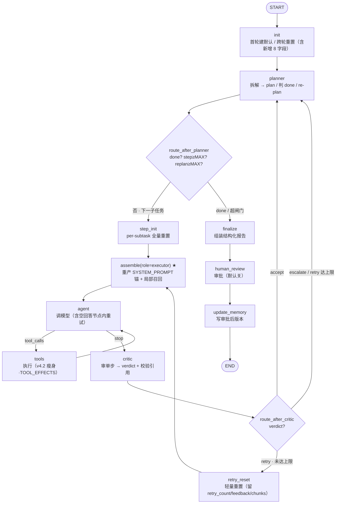

# 第七周设计草稿：planner-executor 技术调研 Agent

> 状态：**v0.4**（E1–E7 全实跑 20/20 + v5.0 实现落地、离线桩测 49/49+23/23+56/56 全过；v0.4 回填两处实现期定的设计语义；详见 [实验结论](../experiment/实验结论.md) 与 [search_agent/README](../search_agent/README.md)）
> 基线：`search_agent v4.2`（week_6）　目标：`v5.0`（多步骤任务规划 / 技术调研 Agent）
> 本文不含实现代码——代码是周四的事，本文产出的是**决策 + 状态图**。
> 设计前提全部来自已锁定的 [规划器与执行器职责边界](规划器与执行器职责边界.md)；本文把那份"概念表态"翻成"可施工蓝图"。
>
> **v0.1 → v0.2 变更**（源自 E1–E5 实测，2026-06-08）：本周机制大多是第六周已验证机制的**降一层复用**，实测**无推翻假设的意外**，七个决策中 A/B/D/E/G 获实证。并入三处精确化：① `route_after_critic` 逻辑三路、物理上塌缩成**两条边**，`add_conditional_edges` mapping 只需 `{planner, executor}`（E1，§2.3）；② 外层双闸门**非冗余**、各兜一个正交维度，实测 escalate 恒压下 `replan_count` 闸门**先收口**，坐实 `MAX_REPLAN=2` 是 re-plan 环的有效断路器（E4，§2.3 / 决策 D）；③ 新增 7 字段**必须全部写进 State schema**（尤其 `critic_verdict`），schema 外字段的更新会被框架静默丢弃（E5，§一 / §三）。其余设计与 v0.1 一致，仅补验证状态标注。
>
> **v0.2 → v0.3 变更**（源自 E6/E7 两个补充桩探针 + 设计评审 4 处缺口补全，2026-06-08）：本次仍**无推翻假设的意外**，E6 还把"正常嵌套任务会撞默认 `recursion_limit`"这一担忧**证伪**——实测默认值 **`DEFAULT_RECURSION_LIMIT=10007`**（非通说的 25），有界任务差三个数量级、永远先被显式闸门收口。并入四处设计补全（"该写明而没写明"，不动主干结构）：① §四 补"跨子任务 messages 重锚"隔离机制 + 实现约束（E7）；② §一 把 `retry_count` 明确为 per-subtask、与 per-task 的 `replan_count` 区分重置粒度；③ 新增 `plan_version` 字段（第 8 个），承接职责边界 §8 的"re-plan × store"风险（本周只打标、不撤回）；④ §2.1 写明 planner 判 `done` 的依据。另：§2.3 / §六并入 E6/E7 实测（recursion_limit 证伪复核 + 跨子任务重锚对照数据），决策表 C 由 E7 补证 executor 窗口隔离一面（20/20 判据全过）。
>
> **v0.3 → v0.4 变更**（周四 v5.0 实现落地后、代码评审敲死两处设计语义，2026-06-09）：实现忠实、缺口 1–4 全接住、无 bug；评审发现两处"文档说一套、代码做另一套 / 没写明"的语义，趁定稿前敲死、回填本文：① **业务 retry 加轻量重置 `retry_reset` 节点**——retry 走 `critic → retry_reset → assemble`（不再直连 assemble），重置 `turn_count`/`has_*`/纠正注入标志，**保留** `retry_count`/`critic_feedback`/`retrieved_chunks`，使每次 retry 是带满额 turn 预算的"全新重做"，修掉"首次跑满 turn 的子任务一被 retry 就因预算耗尽直接 escalate、retry 档形同虚设"（§三 / §五）；② **`assemble` 只服务 executor**——planner 的"看摘要"视角由 planner 节点内自装配（`_planner_messages`）、不走 assemble，`role` 参数保留为前向扩展钩子，文档与代码对齐（§2.2 / §四 / 决策 C）。两处均非主干改动，离线桩测全过（新增 W11 验 retry_reset）。

---

## 〇、本周目标与范围（决策 A 已定）

**roadmap 目标**：多步骤任务规划——planner-executor / decomposition / reflection-critic / 终止与回滚；实战做技术调研 Agent（输入问题 → 出研究计划 → 分步检索总结 → 结构化报告）。

**范围**：在 v4.2 基线上**只加一个外层 plan 循环 + 两个新节点（`planner` / `critic`）**；v4.2 的单步执行引擎（`agent ↔ tools ↔ inject_*` 内层循环）、收尾三连（`finalize → human_review → update_memory`）、Store / RAG 全部**原样复用**。

**关键认识：本周是给 v4.2 套一层外循环，不是重写。** v4.2 已有的是"单问题、单答案"的内层 tool-use 循环（`turn_count` 闸门）。v5.0 在它外面包一层"多子任务"的 plan 循环（`step_index` / `replan_count` 闸门）。两层循环各有独立闸门、互不串扰——这条决定了下面几乎所有设计取舍。

理由：blast radius 最小。v4.2 刚把"第七周前重构五项"落地（tools 瘦身、收尾时序反转、空回答重试、判据重审、引用契约收紧），这些正是外循环要踩的地基，本周不该再动它们，只在其上叠加。

---

## 一、State schema 新增（设计问题 ①）

在 v4.2 `AgentState` 上**新增 8 个字段**（v0.2 锁定 7 个、E1–E5 已覆盖；v0.3 补接 `plan_version` 为第 8 个，承接职责边界 §8 风险），全部沿用 v4.2 既定纪律：除 `messages` 外一律替换语义；需累加的在节点内手动做、不上 reducer。

| 字段 | 类型 | 合并方式 | 谁写 | 说明 |
|---|---|---|---|---|
| `plan` | `list[dict]`（SubTask） | 替换 | planner | 有序子任务列表，每项 `{id, query, status}`；re-plan 时整表替换 |
| `step_index` | `int` | 替换（节点内推进） | planner / edge | 当前执行到第几个子任务；外循环闸门读它 |
| `step_results` | `list[dict]` | **替换（累加在节点内手动做）** | executor | 每步结论 `{step_id, text, citations, status}`；**轮内累加 + init 清空**，照搬 `retrieved_chunks` 先例 |
| `critic_verdict` | `Literal["accept","retry","escalate"]` | 替换 | critic | 单步裁决；critic 后的条件边读它分流 |
| `retry_count` | `int` | 替换（节点内 +1/清零） | critic / step 转移 | **业务层**重试计数（换措辞重做该步）；**与 v4.2 的 `empty_retries` 是两个计数器，不要混**（见 §三）。**per-subtask 字段**：每子任务有独立 `MAX_RETRY` 额度，由 step 转移随 `PER_SUBTASK_DEFAULTS` 清零——若只在 `init` 跨问题重置，子任务 N 会继承前序子任务用光的重试额度而无法重试 |
| `replan_count` | `int` | 替换（节点内 +1） | planner | re-plan 次数，外循环防绕圈闸门读它 |
| `plan_version` | `int` | 替换（planner re-plan 时 +1） | planner | **per-task**；executor 写 store 的子任务结论用它打标。re-plan 作废旧子任务后，靠它甄别 store 里的过期结论（职责边界 §8 风险的最小承接，见 §三末尾） |
| `done` / `termination_reason` | `bool` / `str` | 替换 | planner | planner 判"调研够了"写 `done`，**实际终止由条件边读**（节点干活、边做决策） |

**reducer 判断（不变）**：图仍是顺序的（外循环也是单线，没有并行分支同时写一个字段），所以**唯一 reducer 仍是 `messages` 的 `add_messages`**。`step_results` 要累加，但**刻意不上 `operator.add`**——否则 step 转移想清空就变成"追加空列表"的 no-op（v4.2 `retrieved_chunks` 已踩实这个坑，E3 坐实）。累加在 executor 节点内"当前 + 新"手动做。

**重置职责升级：per-query → per-subtask（本周最容易漏的一处）。** v4.2 的 `init` 把 per-query 标志（`has_*` / `turn_count` / `consecutive_failures` / `*_injected` / `empty_retries`）每问题清零一次。v5.0 的 per-subtask 集合在此之上**新增 `retry_count`**（每子任务独立重试额度）；而 `replan_count` / `plan_version` 是 **per-task**（计整个调研任务的 re-plan 次数与版本，不随 step 清零）——两类计数器的重置粒度不同，别一起放进 `step_reset`。v5.0 里这些 per-subtask 标志是**内层（单子任务）**状态，必须**每个子任务都清零**，否则上一个子任务"已检索过"会让下一个子任务被错误地跳过纠正。

- 解法：新增一段 **step 转移重置**（planner 推进 `step_index` 时，或一个轻量 `step_init` 动作），把内层 per-subtask 标志打回初值——这是 v4.2 `init` "跨轮重置"思维的**降一层版本**（从 per-query 降到 per-subtask）。
- **`PER_SUBTASK_DEFAULTS` 须含 `retry_count: 0`**（E2/E6 桩原只放了 `has_retrieved`/`turn_count`，漏了这条——实现时按本条补齐），`step_reset` 才能每子任务把业务重试额度归零，子任务 N 不继承前序用光的额度。
- `plan` / `step_results` / `replan_count` / `plan_version` / `done` 是**外层（整个调研任务）**状态，**不**随 step 重置，只在 `init` 随新用户问题清零。
- 新增字段的默认值并入 `PER_QUERY_DEFAULTS`（首轮建默认 + 跨轮重置，E2 的 TypedDict-无隐式默认教训照旧适用）。
- **E5 实测精确化**：新增字段**必须全部声明进 `AgentState`**——尤其 `critic_verdict`（critic 写、条件边读）。桩里踩过：schema 外的字段，节点对它的更新会被框架**静默丢弃**、下游条件边读不到（延续第六周"schema 外字段被丢弃"纪律，一个都不能漏；v0.3 补接的 `plan_version` 同守此纪律）。

> 这条是 E2 的直接延伸：v4.2 验证了"per-query 重置"，v5.0 要验证"per-subtask 重置 + per-task 不重置"两层并存（见 §六 E2）。E2 对照组实测泄漏值是 `[False, True]`（非第六周的 `[None, True]`）——因 `init` 已先建 per-subtask 默认值，第六周那条 TypedDict-`None` 坑在本层不复发，泄漏纯粹来自"少了 step 转移重置"。

---

## 二、节点切分（设计问题 ②）

**规则不变**：节点 = 干活 / 改 state；边 = 读 state 做路由决策。

### 2.1 新增节点（work）

| 节点 | 干的活 | 不干什么 |
|---|---|---|
| `planner` | 入口拆解问题→`plan`；**每步后判 `done`：读 `step_results` 各步 status，全部 `accept`/已标记完成则置 `done=True`（终止信号交条件边）**；escalate 时 re-plan（`replan_count += 1` / `plan_version += 1`，整表替换 `plan`） | 不碰检索/工具/引用——只读"问题 + plan + 各步结论摘要" |
| `critic` | 审 executor 单步输出，写 `critic_verdict`（accept/retry/escalate）；校验引用合法性（踩坑 #3 前移到单步侧） | 不改 `plan`、不重写结果、不调模型做业务（只做判定） |

### 2.2 复用节点（v4.2 原样，按需参数化）

| 节点 | v4.2 现状 | v5.0 怎么用 |
|---|---|---|
| `assemble` ★ | 六段装配 | **只服务 executor**：`partial(assemble, role="executor")`，每子任务重产 SYSTEM_PROMPT 锚 + 局部召回（见 §四），记忆开启时复用 v3.0 六段装配。planner 的"看摘要"视角由 planner 节点**内部自装配**（`_planner_messages`）、不走本节点（planner 的临时 prompt 不该污染 executor 的 messages 流）；`role` 参数保留为前向扩展钩子（decision C 的 `partial` 先例，v0.4 实现期对齐）|
| `agent` + `tools` | 单答案 tool-use 内层循环 | **= executor 引擎**，现在每子任务跑一遍；`tools` v4.2 已瘦身，加调研工具只登记 `TOOL_EFFECTS`、节点零改动 |
| `inject_correction_*` / `inject_fallback` | 内层纠正/降级 | 原样保留，属内层；它们的 per-subtask 标志按 §一 每步重置 |
| `finalize → human_review → update_memory` | v4.2 反转后的收尾三连 | **固定链尾，原样接**。注意：planner 判 `done` 后接的是 `finalize`，**不要**按 v4.1 的旧顺序排（v4.2 已把 human_review 挪到 finalize 之后） |

### 2.3 条件边清单（decision，新增两个 dispatcher）

沿用 v4.2 `edges.py` 的写法（复合 dispatcher、`state.get(k, 默认)` 防御取值、闸门主动收口）：

- **`route_after_critic`**（critic 之后，新增）：读 `critic_verdict` + `retry_count`
  - `accept` → `planner`（去判 done / 推进下一步）
  - `retry` 且 `retry_count < MAX_RETRY` → `retry_reset`（轻量重置后回 `assemble` 重做该步，v0.4，见 §三）
  - `retry` 但已达上限，或 `escalate` → `planner`（escalate 通道：换措辞 / 跳过标记 / re-plan）
  - **E1 实测精确化**：判定是三路，但**物理边只有两条**——`accept`、`escalate`、`retry-达上限` 三种结果里后两者同回 `planner`，所以 `add_conditional_edges` 的 mapping 只需 `{planner, retry_reset}` 两个出口，**别写成三出口**（决策落在 `critic_verdict` 字段里，物理边只认落点。v0.4 把 retry 出口从直连 `assemble` 改为经 `retry_reset` 轻量重置，仍是两出口）。
- **`route_after_planner`**（planner 之后，新增）：读 `done` / `step_index` / `replan_count`
  - `done` 或 `step_index >= MAX_STEPS` → `finalize`
  - `replan_count >= MAX_REPLAN`（绕圈兜底）→ `finalize`
  - 否则 → `step_init`（开始下一子任务，per-subtask 全量重置）→ `assemble`
- **内层边全部不动**：`route_after_agent` / `after_tools` / `gate_to_agent`（`turn_count` 闸门）原样——它们管的是单子任务内部，外循环看不见。

**双层闸门（E4 的降一层复用）**：内层 `turn_count < MAX_TURNS`（单子任务的 tool-use 上限，v4.2 原样）+ 外层 `step_index < MAX_STEPS` 且 `replan_count < MAX_REPLAN`（plan 循环上限，新增）。框架 `recursion_limit` 仍只当兜底，正常终止靠这两层自己的闸门——这是 E4"别靠 recursion_limit 正常终止"教训在外循环的重演。

> **E4 实测精确化**：外层两道闸门**非冗余**，各兜一个正交维度——`step_index < MAX_STEPS` 兜"前进步数走太长"，`replan_count < MAX_REPLAN` 兜"原地反复 re-plan 不前进"。桩里 critic 恒发 escalate 时实测 **`replan_count` 闸门先收口**（停在 `step_index=2 < MAX_STEPS=4`、`replan_count=2 = MAX_REPLAN`），坐实 `MAX_REPLAN=2`（决策 D）是 re-plan 环的有效断路器；若只设 `step_index` 一道，escalate 死循环会一直原地 re-plan 直到撞 `recursion_limit` 抛异常——两道缺一不可。

> **E6 复核**：内层 `turn_count` 嵌在外层 step 循环里时，两道闸门互不误伤、`turn_count` 每子任务归零（实测 `[1,1,1,1]`、共 42 super-step）；并实测**默认 `recursion_limit = 10007`**（取自源码 `DEFAULT_RECURSION_LIMIT`、单节点自环恰在此触顶，**非通说的 25、也非脚本注释旧猜的"250 仍不触顶"**）。v5.0 有界任务（几十个 super-step，E6 实测 42）距它三个数量级，**无需显式调高**，`recursion_limit` 维持"几乎不触发的最后兜底"定位即可（仅 `MAX_STEPS×MAX_TURNS` 逼近上万时再复核一次）。

---

## 三、三级重试与两档计数器（设计问题 ③，本周最核心）

职责边界 §4/§5 已定三级重试，本节把它落成**两个独立计数器**，强调"别混"：

| 档 | 计数器 | 在哪 | 兜什么 | 进拓扑？ | 状态 |
|---|---|---|---|---|---|
| 传输层 | `empty_retries` | `agent` 节点内 `while` | API fast-fail 的空回答（实测约两成） | **否**（节点内重试、不耗 turn、不落 checkpoint） | **v4.2 已落地** |
| 业务层 | `retry_count` | `critic → retry_reset → assemble` 回连边 | 检索不准 / 引用错位 / 内容不达标——换措辞重做该步 | **是**（critic 判 retry，经 retry_reset 轻量重置后回 executor） | 本周新增 |
| 计划层 | `replan_count` | `critic → planner`（escalate） | 该子任务方向本身不对，需 planner 改计划 | **是** | 本周新增 |

**非显然之处（务必写进实现注释）**：传输层那档已经在 `agent` 节点里、用 `empty_retries` 量化救回率，它兜的是网络抖动；业务层 `retry_count` 是 critic 主导的"重做该步"，二者**语义不同、计数器分开、闸门分开**。若图省事合成一个计数器，会出现"API 抖了一下就吃掉一次业务重试额度"的串扰——这正是职责边界 §4 末尾反复强调的那条。

**re-plan × store（本周只打标、不做撤回）**：re-plan 后被作废的子任务，其已写入 store 的结论不主动撤回（撤回逻辑留 vN）；本周最小动作是 executor 写 store 时带上 `plan_version`（§一新增字段），使过期结论可事后甄别、不污染当次跨任务召回的判读。这是职责边界 §8 风险在设计层的承接——v0.2 漏接，v0.3 补回。

**业务 retry 的重置语义（v0.4 敲死）**：retry 走 `critic → retry_reset → assemble`，**不经 step_init**。`retry_reset` 是 step_init 的轻量版——把内层执行状态（`turn_count` / `has_searched` / `has_retrieved` / 纠正·降级注入标志 / `consecutive_failures`）打回初值，但**保留三项**：`retry_count`（业务额度，critic 刚 +1）、`critic_feedback`（本次重做指导，assemble 读它进窗口）、`retrieved_chunks`（"换措辞重做"仍可引用首次召回）。理由：职责边界 §5 的 retry = "**重做该步**"，应是带满额 `MAX_TURNS` 预算的全新一次尝试——若沿用首次的 `turn_count`（曾考虑的"整子任务含重试共享一份预算"取舍），首次跑满 turn 的子任务一被 retry 就因预算耗尽直接 escalate、retry 档形同虚设（与三级重试"retry 先于 escalate"的设计相悖）。与 step_init 对称、区别只在保留的三项；离线 W11 验证（retry 后 `turn_count` 归 1 而非累加、`has_retrieved` 复位、`retrieved_chunks`/`retry_count` 保留）。

---

## 四、分层装配（设计问题 ④）

把"六段装配 = 上下文路由"从时间维度（每轮挑段）扩到空间维度（按角色挑段）。两个角色看不同的段：

- **planner 视角**：原问题 + 当前 `plan` + 各步结论**摘要**（不喂检索原文，省 token）。
- **executor 视角**：当前子任务 query + 该子任务召回 + 前序步结论摘要（不喂其他子任务的检索细节）。

**实现落点（v0.4 对齐）**：`assemble` 节点**只服务 executor**（`partial(assemble, role="executor")`，记忆开启时复用 v3.0 六段装配，段 6 换成本子任务局部上下文）。planner 的视角由 planner 节点**内部自装配**（`_planner_messages`）、不走 `assemble`——planner 的临时 prompt 是独立的一次模型调用、不写进 `messages` 流，避免污染 executor 的窗口（与"executor 只看当前子任务"一致）。`role` 参数保留为前向扩展钩子。

**跨子任务窗口隔离（E7 实测，必须写明）**：`messages` 是全图唯一带 `add_messages` 的累加字段，`init` 故意不重置它（保留 thread 历史），所以它**跨子任务只增不减**。"executor 只看当前子任务"**不是新机制**——直接复用 v4.x 的窗口切片：`agent` 发给模型的窗口 = 最后一条 `content == SYSTEM_PROMPT` 的 system 消息起（`nodes._window_start`）。只要每个子任务的 `assemble(role="executor")` **重新产出段 1 的 `SYSTEM_PROMPT` 锚**，`_window_start` 就把窗口切到当前子任务、天然隔离前序子任务的 tool 历史。

> **实现约束**：`assemble(role="executor")` 每步必须重产 `SYSTEM_PROMPT`（段 1）；漏了的话窗口会锚死在第一个子任务，后续子任务的 executor 会看到**前面所有子任务的 tool 结果**（E7 对照组实测：窗口从 `[2,2]` 涨成 `[1,4]`、第二子任务串台 `[False,True]`）。隔离不靠清空 `messages`（有意保留 thread 历史），而靠每步重锚。

**token 预算待验证**：`plan` 越长，planner 看的"各步结论摘要"越胀，会顶上下文上限——给摘要设段预算，旧步结论超预算就压缩（沿用 v4.2 装配的双闸门裁剪思路）。这属真实 API / 上下文质量问题，桩节点（E1–E5，零 API）不覆盖；本周先把 role 分层跑通，预算压缩留作**周四实现期（v5.0）真实 API 下的实测项**。

---

## 五、状态图（v0.4：结构同 v0.1，新增 step_init/retry_reset 两个重置节点；E1–E7 + 实现确认主干无需改）

**图外补充（不画进去免得乱）：**

- 内层 `agent ↔ tools ↔ inject_*` 子循环（含 `turn_count < MAX_TURNS` 闸门、纠正/降级）**原样保留**，上图为清晰只画了主干；它整体就是"executor 引擎"，对外循环是一个黑盒，入口 `assemble(executor)`、出口 `critic`。
- 收尾三连 `finalize → human_review → update_memory` 是 v4.2 反转后的固定链尾，planner 判 done 后接的是它的头 `finalize`。
- `checkpointer` / `store` 仍 `compile(checkpointer=..., store=...)` 包整张图，边界不变。
- **两个重置节点都喂进 `assemble`**（v0.4）：`step_init`（新子任务，全量重置 `PER_SUBTASK_DEFAULTS`）走 `route_after_planner → step_init → assemble`；`retry_reset`（业务 retry，轻量重置、保留 `retry_count`/`critic_feedback`/`retrieved_chunks`）走 `critic → retry_reset → assemble`（见 §三）。per-task 状态（plan / step_results / replan_count / plan_version / done）只在 `init` 随新问题清零。

---

## 六、验证清单（v0.3：E1–E5 周三 + E6/E7 补充探针，已于 2026-06-08 实跑验证，20/20 判据全过，详见 [实验结论](../experiment/实验结论.md)）

桩节点（不调模型、不碰 RAG，只返回固定 dict），零 API，隔离验**框架机制**，不验业务质量。逐条对应上面的决策（实测于 LangGraph 1.2.4；E1–E5 首跑 Python 3.12.3，E6/E7 与全套复跑于 Python 3.13.9（Mac venv 重建于 miniconda），20/20 一致通过）：

1. ✅ **E1** `route_after_critic` 三路分发：单条件边按 `critic_verdict` 把 accept/retry/escalate 正确路由到 planner/executor/planner 三个目标（4/4 判据过；§2.3 / 决策 A）。**实测精确化**：三路 verdict 物理上塌缩成两条边，mapping 只需 `{planner, executor}`。
2. ✅ **E2** 两层重置并存：per-subtask 字段每步清零（`[False, False]`）、per-task `step_results` 跨步累加（2 条）、对照组确实泄漏（`[False, True]`）（3/3 判据过；§一，E2 的降一层延伸坐实）。
3. ✅ **E3** `step_results` 节点内手动"当前 + 新"累加得 `[0,1,2]`、`init` 清空脏数据生效；对照组 `operator.add` 字段 `return []` 清不掉（脏数据 99 残留）（2/2 判据过；决策 G，降一层重演 v4.2 chunks 实证）。
4. ✅ **E4** 外循环双闸门终止 planner↔executor↔critic 环（停在 `step_index=2`、`replan_count=2`）；对照组拆掉闸门单靠 `recursion_limit=10` 抛 `GraphRecursionError`（2/2 判据过；§2.3 双层闸门）。**实测精确化**：escalate 恒压下 `replan_count` 闸门先收口，两道闸门各兜一维度、非冗余。
5. ✅ **E5** 两档计数器不串扰：桩里制造"两次空回答 + 一次业务 retry"，实测 `empty_retries=2`、`retry_count=1` 各记各的、互不吃额度（2/2 判据过；§三，本周最该亲眼看到的一条）。**实测精确化**：`critic_verdict` 须声明进 schema，否则更新被静默丢弃。
6. ✅ **E6（补充探针）** 嵌套双循环 + recursion_limit 预算：内层 `turn_count` 循环真跑几轮后，step 转移仍把它归零（每子任务首进 agent `[1,1,1,1]`）；内外两层闸门嵌套下都正常收口（4 子任务、共 42 super-step）。**附带证伪一个假设**：原担心 `recursion_limit` 在嵌套下被内层每轮吃爆、正常任务就撞限——实测 LangGraph 1.2.4 **默认值 `DEFAULT_RECURSION_LIMIT=10007`**（取自源码并复现，非通说的 25、也非脚本注释旧猜的"250 仍不触顶"），E6 的 42 super-step 差三个数量级，**"`recursion_limit` 只当兜底"的判断成立、无需调高**（仅 `MAX_STEPS×MAX_TURNS` 逼近上万时再复核）（3/3 判据过；§2.3 / 决策 D）。
7. ✅ **E7（补充探针）** 跨子任务 messages 重锚：每子任务 `assemble` 重产 `SYSTEM_PROMPT` 锚后，executor 窗口稳定隔离（`[2,2]`、不串台）；对照组不重锚则窗口锚死、子任务 2 串入子任务 1 的 tool 历史（`[1,4]`、`bled=[False,True]`）。坐实 §四改动 1 的隔离机制与必要性（4/4 判据过；§四 / §一）。

> **实测小结**：本周无推翻设计假设的意外（与第六周唯一意外发现不同）——机制大多是第六周已验证机制的降一层复用，实验坐实"降一层后照旧成立"，外加三处已并入上文的精确化；E6 附带**证伪**了"正常嵌套会撞默认 `recursion_limit`"的担忧（实测默认 10007、有界任务永远先被显式闸门收口），E7 暴露并补回了 §四的一处隔离机制缺口（跨子任务重锚）。完整数据与对照组见 [实验结论](../experiment/实验结论.md)。

---

## 决策定稿（v0.4）

| # | 决策点 | 定稿 | 非显然之处 | 实证 |
|---|---|---|---|---|
| A | critic 放哪 | 独立节点、审单步（不选整体审 / planner 自反思） | 失败都在单步，早拦最便宜；整体审太晚、planner 自审耦合两种判断 | ✅ E1（三路分发；mapping 两出口） |
| B | 重试分层 | 三级：传输层 `empty_retries`（v4.2 已有）/ 业务层 `retry_count`（新）/ 计划层 `replan_count`（新） | **三个计数器分开**，混成一个会出现"API 抖动吃掉业务重试额度"的串扰 | ✅ E5（`empty=2`/`retry=1` 互不吃额度） |
| C | 装配分层 | executor 看局部召回（`assemble(role=executor)`）、planner 看摘要（节点内自装配 `_planner_messages`）；`role` 参数留作前向钩子（v0.4 对齐：assemble 只服务 executor） | 六段装配从时间维度扩到空间维度；planner 临时 prompt 不进 messages 流、不污染 executor 窗口 | ✅ E7（executor 窗口靠每子任务重产 `SYSTEM_PROMPT` 锚 + `_window_start` 隔离"看局部"一面）；token 预算压缩仍留真实 API |
| D | re-plan | 受限，`MAX_REPLAN=2` | 静态 plan 太脆（一步查空全废）、无限 re-plan 绕圈，两害相权 | ✅ E4（escalate 恒压下 replan 闸门先收口）+ E6（默认 `recursion_limit=10007`、有界任务永不触顶，显式闸门才是真收口） |
| E | 终止 | planner 写 `done`，条件边读它终止 | 节点干活、边做决策；外层双闸门主动收口，`recursion_limit` 只兜底（E4/E6） | ✅ E4（双闸门在 `recursion_limit` 前收口）+ E6（默认 limit 10007，正常任务永不触顶） |
| F | 引用契约 | v4.2 已在抽取侧收紧；本周 critic 把同契约**前移到单步输出侧** | 别等攒进 store 才发现引用错位，executor 产出即强制 + critic 校验、不合法判 retry | — 留周四实现（属业务质量，桩节点不验） |
| G | 新增字段合并 | 8 字段全替换语义（含 v0.3 补接的 `plan_version`）；`step_results` 节点内手动 append、**不上 reducer** | 带累加 reducer 的字段 `return []` 清不掉（E3 实证）；重置职责降一层到 per-subtask | ✅ E3（手动累加 `[0,1,2]`；reducer 清不掉脏数据） |

---

*v0.4，2026-06-09。基于 search_agent v4.2；E1–E7 验证完毕（20/20，LangGraph 1.2.4 / Python 3.13.9）+ v5.0 实现落地（离线桩测 49/49+23/23+56/56）。决策 A/B/D/E/G 获实证、C 由 E7 补证；F（引用契约）已在 critic 落地（`_citations_legal` + test_store_memory 验编造来源进不了库）。v0.4 回填两处实现期定的设计语义（retry_reset 轻量重置 / assemble 只服务 executor），无推翻假设的意外、无 bug。*
*设计前提见 [规划器与执行器职责边界](规划器与执行器职责边界.md)（v4.2 基线）；验证数据见 [实验结论](../experiment/实验结论.md)；实现见 [search_agent/README](../search_agent/README.md)。*
*版本记录：v0.1（2026-06-0x，周二设计日初稿，决策表已锁）→ v0.2（2026-06-08，并入 E1–E5 实测：§2.3 critic 物理两出口 + 双闸门各兜一维度、§一 schema 必须声明字段、§六验证清单标注结果、决策定稿表加实证列）→ v0.3（2026-06-08，补充探针 E6/E7 后并入：§四 跨子任务重锚机制 + 实现约束、§一 `retry_count` 明确 per-subtask、新增 `plan_version` 承接职责边界 §8、§2.1 planner `done` 计算依据、§2.3 + §六并入 E6/E7、决策表 C 由 E7 补证 / D·E 加 E6 实证）→ v0.4（2026-06-09，周四 v5.0 实现 + 代码评审后回填两处设计语义：① 业务 retry 加 `retry_reset` 轻量重置节点（§三/§五，新增 W11 验证）、② `assemble` 只服务 executor、planner 节点内自装配、`role` 留前向钩子（§2.2/§四/决策 C）。实现忠实、无 bug、无推翻假设的意外）。*
