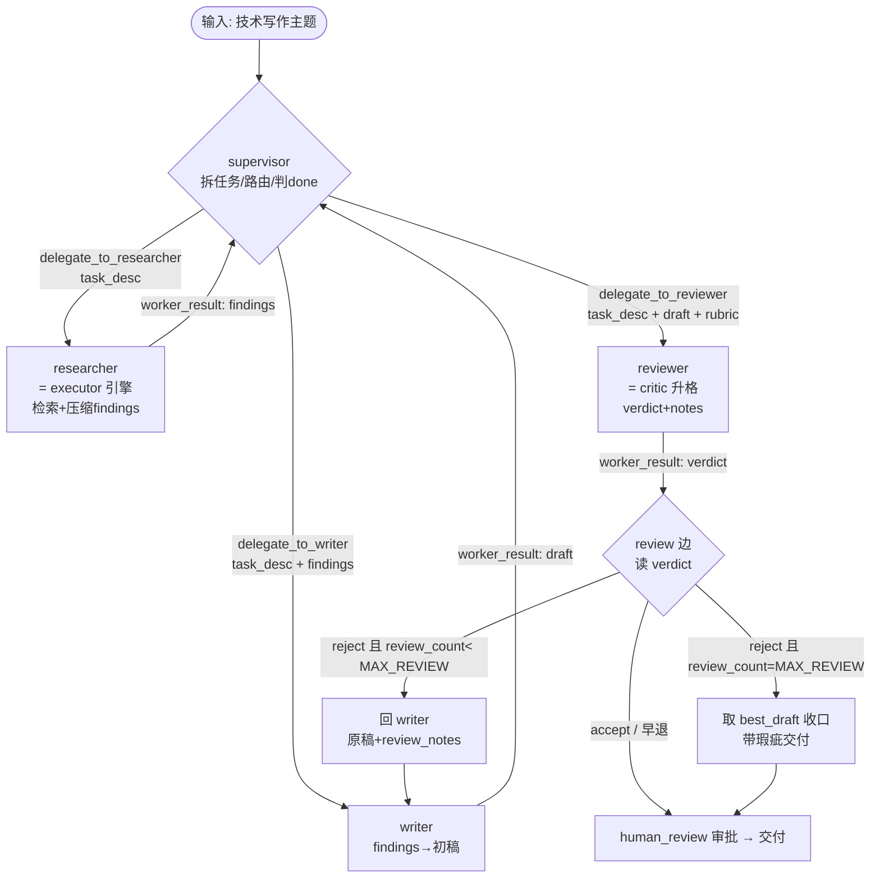

# 第八周设计草稿：supervisor 多 Agent 技术写作 Agent

> 状态：**v0.3**（周五真实跑并入：4 题真实 API 跑挖出 **2 个已修代码缺陷 + 3 个记录在案策略缺口**，三条 v6.0 新机制 real 级坐实；见各节 `[v0.3]` 标记 + 新增 §八）。v0.2 = 周三桩测 E1–E7 **7/7 全过**并入（各节 `[v0.2]`）。v0.1 = 周二设计日初稿。
> 基线：`search_agent v5.0`（week_7，planner-executor-critic 外循环）　目标：`v6.0`（supervisor 多 Agent）
> 本文不含实现代码——本文产出的是**决策 + 状态图 + 已验证清单（桩测 7/7 + 真实跑 4 题已并入）**。真实跑详见 `experiment/真实跑结论.md`。
> 设计前提：周一《第八周概念认知参考答案》（拓扑 A/B/C、委派契约四要素、§四上下文路由升级、那根"researcher→writer→reviewer 是顺序依赖流水线"的刺）；决策 A 已定 **B（LangGraph supervisor）**、决策 E 已定 **`MAX_REVIEW=2`**。

---

## 〇、本周目标与范围

**roadmap 目标**：多 Agent 入门——handoff / centralized orchestration vs agent-to-agent / 角色拆分（planner / researcher / writer / reviewer）。实战做一个 3 角色系统（researcher 查资料、writer 写初稿、reviewer 审阅打回），**明确每个角色的输入输出格式**。产出：第一个多 Agent demo + 《什么时候该用多 Agent，什么时候不要用》。

**范围**：在 v5.0 基线上，把"一张图里的角色节点"升格成 **supervisor 协调的独立 workers**——新增 supervisor 路由 + writer 角色 + writer↔reviewer 打回循环 + 工具式 handoff（携带 task_description）；v5.0 的 executor 单步引擎（`agent ↔ tools ↔ inject_*`）、Store / RAG / 接地软闸门、`human_review` 审批全部**原样复用**。

**关键认识：本周是把角色节点升格成独立 workers，不是重写引擎。** researcher = executor 引擎升格、reviewer = critic 升格、supervisor = planner 升格；真正"新"的只有 writer 角色、handoff 工具契约、writer↔reviewer 打回循环三块。理由同第七周：blast radius 最小，v5.0 刚收口的接地软闸门 / skip-and-advance / synthesis-reserve 是本周要踩的地基，不该再动。

**诚实记一笔（承周一的刺，务必写进《什么时候该用多 Agent》）**：researcher → writer → reviewer 是一条**强顺序依赖流水线**（writer 要 researcher 产出、reviewer 要 writer 草稿）。按 Anthropic"子任务强依赖 → 不适合多 Agent / 并行退化成串行"的判据，这里 supervisor 是**串接专家、不是并行 fan-out**，买不到"真并行"，只买到"角色专精 + 干净的 handoff 契约"。**所以本周 demo 的价值点刻意放在"角色 I/O 契约 / handoff 协议本身"（§三），而非"证明多 agent 更强"。** 本周 demo 将作为《什么时候该用多 Agent》的反例论据：顺序流水线用一张图（拓扑 A）其实更省，选 B 是为了学机制。

---

## 一、拓扑与角色（决策 A、B）

### 决策 A — 拓扑选型：B（LangGraph supervisor）✅ 已锁

| 选项 | LangGraph 落地 | 取舍 | 锁定 |
|---|---|---|---|
| A 单图加节点 | v5.0 上加 writer/reviewer 节点、共享 state | 最省最稳，但学不到隔离与 handoff（本周白学） | ✗ |
| **B supervisor** | supervisor 路由节点 + 工具式 handoff `delegate_to_X` + worker 独立上下文 | 学到委派契约 + 上下文路由；orchestrator 收口、trace 清晰、可控性高于 swarm | **✅** |
| C swarm | worker 间直接 `Command(goto=..., graph=Command.PARENT)` 交接 | 最贴 handoff 主题，但顺序链上收益有限、且要防打回不收敛 | ✗（留 vN） |

**选型依据**：研究/写作型负载、需要 orchestrator 保留控制权并串接多个专家——这是 supervisor 的典型场景（与 OpenAI handoff 那种"专家完全接管对话"的客服式场景相对）；且业界通用建议"先 supervisor，等数据证明延迟是瓶颈再升 swarm"。

**子决策 A′ — prebuilt `create_supervisor()` vs 手搓 supervisor 节点**：**手搓**（与 v5.0 的手写 planner 一致、控制权在手、便于把 v5.0 furniture 降层复用进来）。`langgraph-supervisor` 的 prebuilt 留作**对照实现**。工具式 handoff 的好处正是给更强的上下文工程控制权，这与手搓不冲突。

> **`[v0.2]` E1 实测修正——prebuilt 对拍不进桩测层**：原计划"周三 E1 拿 prebuilt `create_supervisor` 当 routing 正确性对拍基线"被证伪——prebuilt 的路由是 **LLM 调 `transfer_to_X` handoff 工具的决策、必须绑定 `model`**，不是零 API，拿它当桩测对拍会破"桩 worker 不接 LLM"的第一纪律（且 `langgraph-supervisor` 未装、不在 `requirements.txt`）。→ **prebuilt 对拍移到周末真实跑日做**（那天本有 API）；桩测层 E1 对照改用**零 API 的"写歪路由"探针**（`route_bug` 旋钮恒派 writer、无视阶段，让 `routing_accuracy` 评测抓它，实测命中 1/3）。E1 同时把评测沉淀成可复用的 `routing_accuracy(SEED)` 函数（种子集 3 条，第十周扩到 20+）。

### 决策 B — 角色花名册与职责边界 ✅ 已锁

| 角色 | 来源 | owns（负责） | 不碰（边界） |
|---|---|---|---|
| **supervisor** | planner 升格 | 拆任务、按 task_description 派活、判 done、收口最终交付 | 不自己检索 / 写作 / 评审 |
| **researcher** | executor 引擎升格（原样复用内层 `agent↔tools↔inject_*`） | 按子任务检索 + 压缩 findings 回传（带引用） | 不写最终稿、不自评 |
| **writer** | **全新**（v5.0 无；部分承接 v5.0 `finalize` 的装配职责） | 把 findings 组织成初稿（保留引用） | 不自己检索、不自评 |
| **reviewer** | critic 升格 | 审稿 + 出 verdict（accept/reject）+ 具体修改意见 | **不改稿**（只给意见，改稿是 writer 的事） |

> v5.0 的 `finalize`（装配结构化报告）被 **writer** 接管——composition 从"代码装配"升格成"LLM 写作角色"；reviewer 在其后加打回循环；`human_review`（人工审批）保留为最终关口。

---

## 二、State schema 新增（设计问题 ①）

在 v5.0 `AgentState` 上新增字段，沿用 v5.0 纪律：**除 `messages` 外一律替换语义；需累加的节点内手动做、不上 reducer**（E3 of week_7 实证：带累加 reducer 的字段 `return []` 清不掉）。

| 字段 | 类型 | 合并 | 谁写 | 说明 |
|---|---|---|---|---|
| `active_worker` | `str`（researcher/writer/reviewer/None） | 替换 | supervisor | 当前被委派的 worker；None = supervisor 持有控制权 |
| `task_description` | `dict` | 替换 | supervisor | 委派契约四要素（§三）：objective / output_format / tools_hint / boundary |
| `findings` | `list[dict]` | **节点内手动累加** | researcher | researcher 压缩回传的结构化要点 + 引用，每子任务一项 |
| `draft` | `str` | 替换 | writer | 当前初稿（每次返修覆盖） |
| `review_verdict` | `str`（accept/reject） | 替换 | reviewer | **必须声明进 schema**（week_7 E5 教训：schema 外更新被静默丢弃） |
| `review_notes` | `str` | 替换 | reviewer | 本轮具体修改意见，喂给下一稿（Reflexion verbal reinforcement，§五） |
| `review_count` | `int` | 替换（节点内 +1） | reviewer 边 | 打回计数，**独立于 `replan_count`**（§五，正交维度、别混） |
| `best_draft` | `dict`（`{draft, score}`） | 替换（仅当更优时） | reviewer 边 | best-so-far：达 `MAX_REVIEW` 时取它收口（§五，防 behavioral collapse） |
| `worker_result` | `dict` | 替换 | 各 worker | worker 压缩回传给 supervisor 的统一信封（隔离上下文，§六） |

`plan` / `step_results` / `plan_version` / 三计数器（`empty_retries`/`retry_count`/`replan_count`）等 v5.0 字段**原样保留**——researcher 内层照旧用它们。

---

## 三、角色 I/O 契约（决策 C，本周核心交付）

这是 roadmap 明确要求的"明确每个角色的输入输出格式"，也是周一定的本周价值点。每个角色钉死 in/out schema：

| 角色 | 输入（in） | 输出（out） |
|---|---|---|
| **researcher** | `{subtask_query: str, boundary: str}`（boundary = "别查什么、归谁管"） | `{findings: [{point, citations}], coverage: str}` |
| **writer** | `{findings: [...], outline: str, prior_draft?: str, review_notes?: str}` | `{draft: str（含引用标注）}` |
| **reviewer** | `{draft: str, rubric: [二元判据]}` | `{verdict: accept\|reject, notes: str（逐条对应 rubric）}` |
| **supervisor 派活** | —— | `task_description`（见下四要素） |

### supervisor 委派契约（task_description 四要素）

承周一 Q5——多 Agent 工程的难点不在并行，在 orchestrator 把任务讲清楚。每次 handoff 携带的 `task_description` 必须四要素齐全，缺一 worker 就漂：

1. **objective**：这个 worker 这一轮要达成什么；
2. **output_format**：产出长什么样（好让 supervisor 消费 / 下一个 worker 接得住）；
3. **tools_hint**：用哪些工具 / 查哪些源（researcher 用 `retrieve_documents`；writer/reviewer 无工具）；
4. **boundary**：明确"别碰 X、那归谁"——**这是 v5.0 唯一系统性缺的第 4 条**（A 拓扑共享 state 天然不撞车，B 拓扑各自独立上下文必须显式写）。

> **rubric 要二元、不要开放式**：reviewer 的判据写成可勾选的二元项（"引用是否齐全 / 是否有未接地论断 / 结构是否完整"），不要"这稿好不好"——含糊 rubric 会让打回循环烧 token 但质量不涨。这条也是 §五 早退能干净触发的前提。

---

## 四、委派 / handoff 协议 + 上下文隔离（决策 D、F）

### 决策 D — 工具式 handoff（§四"按角色路由上下文"的升级）✅ 已锁

- **派活**：supervisor 通过工具式 handoff（`delegate_to_researcher/writer/reviewer`）路由，handoff 工具携带 `task_description` 四要素。
- **回收**：worker **压缩结论回传**（`worker_result` 信封），**不把整个探索轨迹倒给 supervisor**——researcher 回 findings 摘要而非全部 chunk、writer 回 draft 而非草稿历程。
- **省 token 可选项**：supervisor 转发 worker 回应给下游时可直接转发、不复述（forward-message 思路），留作 v0.x 优化、本周非必需。

### 决策 F — 上下文隔离与路由 ✅ 已锁（含一个必须点明的坑）

**坑**：LangGraph 的 supervisor **默认共享 message history**，这**不等于** Anthropic 那种物理独立上下文窗口；真隔离是一个需要刻意拧的旋钮。本周的隔离靠两件事：

1. **state 分区**：findings / draft / review_notes 各自独立字段（§二），worker 只读它该读的分区，不读全 `messages`；
2. **worker 视图裁剪**：researcher 接 `{subtask_query, boundary}`、writer 接 `{findings, outline, review_notes}`、reviewer 接 `{draft, rubric}`——各看各的，靠 `task_description` + 选择性读 state 实现，而非共享全历史。

这正是第七周 §四"按角色挑段"从"共享池里挑"升级成"跨 worker 的交接什么 / 回收什么"。

> **`[v0.2]` E5 实测——隔离的实现形态（本周唯一真·新机制，文档缺口已补）**：E5（已实跑、PASS）暴露上面"state 分区 + 视图裁剪"只是**意图**，真正的机制事实有三条，必须写明否则实现会串台：
> 1. **框架不分区**：LangGraph 每个 worker 节点函数物理上收到的是**全 state dict**（对照组实测 writer 越界读到全 17 个键、含 reviewer 私有 `draft_score/review_verdict/best_draft/review_notes`）。所谓"state 分区"不是框架护栏、是**约定**。
> 2. **越界读静默、不报错**：worker 读不属于它的字段不会抛异常、只会拿到别的 worker 私有值并串进产出。没有任何框架级信号——这比第七周 E5"少读（schema 外更新被丢弃）"更隐蔽，因为这是**多读**。
> 3. **所以隔离必须落成"每 worker 一个显式投影函数"**：`researcher_view(state)→{subtask_query,boundary}`、`writer_view(state)→{findings,outline,review_notes}`、`reviewer_view(state)→{draft,rubric}`，喂给 LLM 的只能是投影结果、不能是 `state` 本身。与第七周 E7"executor 看局部靠每子任务重产 SYSTEM_PROMPT 锚"同构——隔离不是天生的，是每次刻意裁出来的。

**E5 隔离实测生效**（主组三 worker 可见集精确等于各自设计视图；对照组关隔离 → writer 返修第二遍越界读 reviewer 私有 = 串台）。

> **`[v0.3]` 真实跑复证隔离 + 暴露"隔离代价"缺陷**：周五 4 题真实跑 `isolation_clean=True` 4/4——真模型下三 worker 可见集仍精确 = 设计视图、**没串台**（桩 E5 的 real 复证）。但真实跑暴露隔离的**代价侧缺陷**：writer 只看 findings 投影、看不到研究全轨迹，而 `_make_finding` 把每条 finding 截到 **600 字**——A/B/C 三题 **12/12 条 ok finding 全部触顶 600**，writer 被系统性饿瘦（C 成稿丢项目特定细节）。→ **修：`FINDING_MAX_CHARS = 600→1500`**（D 复跑实测 finding=1500、48/48 桩测无回归）。隔离与"喂够 writer"的张力是 B 拓扑的固有代价，600 这个旋钮拧太紧了。另一处缺陷：`[doc#section]` 字面模板占位（SYSTEM/WRITER_PROMPT 的格式范例）被模型原样抄进正文、漏成引用（reviewer 自己在 B round-1 抓出它）→ **修：`_extract_citations` 剔除字面占位**。两修详见 §八 / `experiment/真实跑结论.md`。

---

## 五、reviewer 打回循环：终止与回滚（决策 E）✅ 已锁

直接降层复用第七周 escalate / skip-and-advance / `replan_count` 的断路器思路。定稿如下：

- **上限 `MAX_REVIEW = 2`**：reviewer 最多打回 2 次（writer 最多写 3 稿：初稿 + 2 返修）。落在业界"2–3 轮足够"的甜区，且与 `MAX_REPLAN=2` 数量级一致、整套闸门统一。若周末真实跑发现 2 次会切掉"还在变好的稿"，再升到 3（第七周式"真实跑暴露再调"）。
- **早退**：reviewer 一判 `accept` 立即出循环，**不耗满预算**——`MAX_REVIEW` 只兜"一直 reject"的死循环，正常根本到不了（同 `recursion_limit` 只兜底的定位）。
- **打回给"原稿 + review_notes"，不重来**：对应 v5.0 `retry_reset` 保留 `critic_feedback`；进一步做 **Reflexion verbal reinforcement**——把"为什么没过"喂给下一稿，避免重复同类错误。
- **达上限取 best-so-far 收口，不取最新稿**：已知失败模式 behavioral collapse——后一稿可能比前一稿更差。最小实现：达 `MAX_REVIEW` 时带瑕疵交付 `best_draft`（reviewer 评分最高的那稿），呼应 skip-and-advance 的优雅收口；不上严格逐步比分（过早优化）。
- **`review_count` 独立于 `replan_count`、别混**（第七周"三计数器别串扰"的重演）：两者兜正交维度——`replan_count`（supervisor 级）兜"这个子任务做不下去、跳过"，`review_count`（writer↔reviewer 级）兜"这稿不够好、返修"。合成一个会出现"某子任务被 skip 顺手吃掉一次返修额度"的串扰。
  > **`[v0.2]` E4 实测精确化——写字段 ≡ 读字段**：E4（PASS，独立组 `replan=1/review=2`、合并组 skip 吃额度只 review 1 次）暴露串扰的精确机制不在"少跑几次 review"，而在**每个计数器的"谁写" 必须钉成与闸门边"读谁"同一个 key**。若写 `replan_count` 却让闸门仍读 `review_count`（写读错位），后果不是"少返修几次"而是**计数器永不达阈、直接死锁撞 recursion**。→ §二 schema 落地时，`review_count` 的"reviewer 边 +1"与 `make_route_after_reviewer` 的"读 `review_count`"必须同 key（呼应第七周 E5"schema 外更新被静默丢弃"）。

**双层闸门（第七周双闸门的再降层）**：内层 `turn_count < MAX_TURNS`（researcher 内的 tool-use 上限，v5.0 原样）+ 外层 `review_count < MAX_REVIEW`（打回循环上限，新增）。框架 `recursion_limit=10007` 仍只当兜底（week_7 E6 实测、有界任务差三个数量级）。

> **`[v0.2]` E7 实测 + scope 诚实**：E7（PASS）实测内外两层嵌套互不误伤、外层 review 闸门先收口（恒 reject 停在 `review_count=2`）、收口总 super-step **10**、距默认 `recursion_limit=10007` 约 1000 倍（本周环境复核第七周 E6 结论仍成立，无需显式调高）。**但一条 sub-claim 属继承非本周复证**：本周桩把 researcher 收缩成**单次调用**（findings 一次性返回、无 plan 子任务内循环），故"`turn_count` **每次进 researcher** 归零（不跨 worker 累加）"没在本周重跑出来——它继承自第七周 E6（那条真跑 4 子任务、实测 `[1,1,1,1]`）。本周 E7 实证的是更弱但仍关键的一条：`turn_count` 限在 researcher 内层 scope、终态（=3）不被外层累加成全局计数器。→ 周四 v6.0 若给 researcher 接回真 plan 内循环（多次进 researcher），"每次归零"需在那时复证。

> **`[v0.3]` 真实跑：打回循环主力路径坐实，两条断路器路径未触发（诚实）**：桩 E3 验的是"恒 reject 撞闸门收口"的**断路器**路径；周五真实跑验的是**正常主力**路径——A/B/C 三题初稿 reject→拿 review_notes 返修→accept，score 全部**升**（0.85→0.95 / 0.40→0.95 / 0.65→0.95），Reflexion 不是重写、是针对性改（B 把 reviewer 抓出的 `doc#section`/引用堆砌清掉）。**reviewer 落在"健康中段"**：不太松（3 题初稿都 reject）、不太严（从不连续 reject 两次）。代价：① **best-so-far / MAX_REVIEW 双-reject 收口在真实跑未触发**（健康 reviewer 到不了双 reject），仍只桩 E6 验过；② **skip 防御收口** A/B/C 也没压到（健康路径不 skip）→ 故造 Topic D（杜撰 QSCC 模块）强制压出：`replan_count=2 / review_count=0` 正交、2/3 子任务 skip 后 ok_findings=1 时 writer 仍写出成稿（防御式部分收口 real 坐实）。`MAX_REVIEW=2` 暂不改（真实跑没出现"2 次切掉还在变好的稿"，恰恰相反、1 次返修就 accept）。详见 §八。

---

## 六、复用边界与控制流分层（决策 G、H）

### 决策 G — 复用什么 vs 新增什么 ✅ 已锁

| 复用（v5.0 原样） | 新增（v6.0） |
|---|---|
| executor 内层引擎 `agent↔tools↔inject_*`（researcher 的躯体） | supervisor 路由节点 + 工具式 handoff |
| critic 判据逻辑（reviewer 的躯体） | writer 角色（全新） |
| 接地软闸门 `CITATION_MIN_GROUNDING=0.5` + store 白名单 | writer↔reviewer 打回循环 + `review_count` 闸门 |
| Store / RAG / 记忆装配 / `human_review` 审批 | task_description 四要素契约 + best-so-far 收口 |

### 决策 H — 控制流分层：纠正/降级在哪一层 ✅ 已锁（承周一 Q3 + 第三周 Loop 笔记 Q3，跨两周悬念结案）

| 层 | 闸门 / 机制 | 兜什么 |
|---|---|---|
| 内层（researcher 内） | `turn_count` + synthesis-reserve + 空回答重试 `empty_retries` | "该搜没搜 / 连续失败降级 / 检索吃光轮次"——单 worker 内部的事 |
| 外层（supervisor 级） | `review_count`（打回）+ `replan_count`（skip-and-advance）+ recursion guard | 角色级路由、打回收敛、子任务跳过 |

**worker 失败上报**：researcher 内层失败（turn 跑满空产出）→ 压缩成"本子任务部分失败"信封回传 supervisor → supervisor 走 skip-and-advance（`replan_count`），**不**让内层失败穿透成全局崩溃。这与 v5.0 的 403→占位→skip 优雅收口同构。

---

## 七、状态图（拓扑，v0.1）

> researcher 节点内部仍是 v5.0 的 plan 外循环 + tool-use 内循环（`step_index`/`replan_count`/`turn_count` 闸门照旧），此图只画到 worker 边界、不展开内层。

---

## 八、真实跑暴露与修复（v0.3，周五真实 API 跑并入）

桩测 7/7 全绿是**必要非充分**（承第七周"离线验接线、真实验策略"）。周五接真实 qwen 压 4 题（A 打回 / B skip / C 5 子任务长链纵向对比 / D 强制 skip）。**v6.0 三条新机制 real 级坐实**：打回循环+Reflexion（score 升）、skip-and-advance+正交计数器（D：replan 2/review 0）、隔离投影不串台（4/4 clean）。**挖到 2 个已修代码缺陷 + 3 个记录在案策略缺口**：

| # | 缺陷（真实跑暴露） | 处置 | 验证 |
|---|---|---|---|
| 1 | findings 600 截断对 **12/12 条 ok finding 全触顶**、饿瘦 writer（隔离代价旋钮拧太紧） | **已修** `FINDING_MAX_CHARS 600→1500` | D 复跑 finding=1500；桩测 48/48 无回归 |
| 2 | `doc#section` **字面模板占位**漏成引用（prompt 范例被抄进正文，reviewer 自己抓出） | **已修** `_extract_citations` 剔除字面占位 | D 交付 `doc#section`=0（A 修前=1） |
| 3 | skip 后 writer **静默吞掉跳过的子任务**、正文不标缺口（rubric"扣题"只查覆盖 findings、不查覆盖原始主题） | 记 v0.3：正文显式标"未覆盖：[skipped]" + rubric 加"是否声明缺口" | 待下次真实跑 |
| 4 | **引用堆砌**（单句挂 10+ 引用）——但**打回循环已自愈**（reviewer 兜底 writer 过度，§一价值点实证） | 记 v0.3：WRITER_PROMPT 约束每论断 1–2 引用 | 自愈/待验证 |
| 5 | supervisor 把"本项目"题拆成**通用子任务** → researcher web 漂移烧 token（C） | 记 v0.3：SUPERVISOR_PROMPT 保留"本项目/本地库"语境锚 | 待验证 |

**成本账**：researcher（继承 v5.0 RAG 引擎）独占 79–85% token，v6.0 新增 writer+reviewer 打回层仅 ~8–12%——**多 Agent 串接没炸开成本**，贵的是内层检索（老问题）。但 4 题合计 **~103 万 token 一个 session 烧穿免费额度**（qwen3.7-max 跑完 A/B/C 即 403、D 改用旧模型残量）——评测/复跑要算额度账。

**v5.0↔v6.0 同题（C）纵向对比**："降一层复用"实证——v5.0 `finalize` 机械拼接 6 步 step_results = **20,905 字**结构缝合怪；v6.0 writer 跨 findings 综合 + reviewer 二元 rubric 把关 = **2,037 字**成稿（10× 更短更顺、有质量门，代价是丢部分项目细节+叠加缺陷#1）。

> 诚实：best-so-far 双-reject 收口在真实跑**未触发**（健康 reviewer 不双 reject），仍只桩 E6 验过；D 跑在旧模型，reviewer 严格度的"模型 vs 题型"两变量未解耦。详见 `experiment/真实跑结论.md`。

---

## 决策定稿表（v0.3，A–H，状态=桩测 E1–E7 7/7 + 真实跑 4 题并入）

| # | 决策点 | 定稿 | 非显然之处 | 实测（2026-06-12，7/7） |
|---|---|---|---|---|
| A | 拓扑 | B（supervisor，手搓节点；prebuilt 留对照） | 顺序流水线本可用 A 更省，选 B 为学机制；价值在 handoff 契约 | ✅ E1 `routing_accuracy=3/3`；prebuilt 对拍非零 API、移周末（见 A′ `[v0.2]`） |
| B | 角色花名册 | supervisor/researcher/writer/reviewer，各 owns 明确 | writer 全新、承接 v5.0 finalize 的 composition；reviewer 不改稿 | ✅ E1/E2 阶段派对、契约到达 |
| C | I/O 契约 | 四角色 in/out schema + task_description 四要素 | 第 4 条 boundary 是 v5.0 唯一系统性缺的；rubric 要二元 | ✅ E2 四要素齐全、boundary 不丢 |
| D | handoff 协议 | 工具式 handoff 携带 task_desc；worker 压缩回传 | 回收摘要而非全轨迹，否则上下文爆 | ✅ E2/E5 |
| E | 打回循环 | `MAX_REVIEW=2` + 早退 + 保留 notes + best-so-far 收口 + 独立计数器 | review_count 与 replan_count 正交、别混；取最好稿防 collapse | ✅ E3 停 count=2、E4 不串扰、E6 取 best=0.8（含"写字段≡读字段" `[v0.2]`） |
| F | 上下文隔离 | state 分区 + worker 视图裁剪（**= 每 worker 显式投影函数**，框架不分区） | supervisor 默认共享 messages ≠ 物理隔离；越界**多读**静默串台、框架无护栏 | ✅ E5（文档缺口已补，见 §四 `[v0.2]`——本周唯一真·新机制） |
| G | 复用边界 | 升格不重写：researcher=executor、reviewer=critic、supervisor=planner | 真正新增仅 writer/handoff/打回循环三块 | ✅ E7 内外闸门互不误伤 |
| H | 控制流分层 | 内层 turn_count + 外层 review_count/replan_count；recursion 只兜底 | worker 失败压缩回传、不穿透成全局崩溃 | ✅ E7 super-step=10≪10007；"每次归零"属继承待复证（见 §五 `[v0.2]`） |

---

## 已验证清单（桩测 E1–E7 7/7 + 真实跑 4 题，详见 `experiment/实验结论.md` 与 `experiment/真实跑结论.md`）

v0.1 锁的是接线蓝图，下面这些"框架机制成不成立"用桩节点（零 API）隔离验完毕，每条配对照组。结论分三类：**巩固型**（E2/E3/E4/E6 升格后照旧成立，符合预期）+ **发现型**（E1/E5 两处给设计挑出错、已并入）+ **scope 诚实**（E7 一条 sub-claim 属继承）：

1. ✅ **supervisor 路由正确性**：`routing_accuracy=3/3`；对照"写歪路由"被评测抓出（1/3）。**发现型**：原计划 prebuilt 对拍非零 API、移周末（§一 A′ `[v0.2]`）。
2. ✅ **task_description 四要素完整传到 worker**：四键齐全、boundary 不丢；漏 boundary 可检出。
3. ✅ **`review_count` 打回闸门收口**：恒 reject 停在 `count=2` 走 best-so-far；拆闸门撞 recursion。
4. ✅ **`review_count` 与 `replan_count` 不串扰**：独立组 `replan=1/review=2`；合并组 skip 吃额度只 review 1 次。**精确化**：写字段≡读字段（§五 `[v0.2]`）。
5. ✅ **上下文隔离真生效**：三 worker 可见集=各自设计视图；关隔离 → writer 越界读 reviewer 私有 4 键 = 串台。**发现型**（本周唯一真·新机制）：隔离 = 每 worker 显式投影函数、框架不分区无护栏（§四 `[v0.2]`）。
6. ✅ **best-so-far 收口**：达上限取 best=0.8、对照取最新=0.5（更差）。**边界**：很少触发的低成本安全网、主力是早退（§五 `[v0.2]`）。
7. ✅ **内外两层闸门嵌套 + recursion 只兜底**：super-step=10≪10007、外层 review 闸门先收口。**scope 诚实**：本周 researcher 单次调用，"每次归零"属继承第七周 E6、待接回内循环复证（§五 `[v0.2]`）。

**`[v0.3]` 真实跑（4 题，2026-06-15）追加坐实**（详见 §八 / `experiment/真实跑结论.md`）：

8. ✅ **打回循环+Reflexion（real）**：A/B/C 初稿 reject→返修→accept、score 全升；reviewer 落健康中段（不太松/不太严）。**两条断路器路径真实跑未触发**（best-so-far 双 reject、A/B/C 的 skip 收口）——仍桩 E3/E6 验。
9. ✅ **skip-and-advance+正交计数器+防御收口（real，Topic D）**：杜撰 QSCC 模块逼出 `replan=2/review=0` 正交、2/3 子任务 skip 后 ok_findings=1 时 writer 仍成稿。
10. ✅ **隔离投影不串台（real）**：4/4 题 `isolation_clean=True`，真模型下可见集仍=设计视图（桩 E5 real 复证）。
11. 🔧 **2 修**：findings 截断 `600→1500`（饿瘦 writer，12/12 触顶）+ `doc#section` 占位剔除（reviewer 自抓）；**3 记 v0.3**：skip 缺口正文标注 / 引用堆砌 / supervisor 通用化拆解。

---

*v0.3，2026-06-15（周五真实跑并入）。v0.2，2026-06-12（桩测 E1–E7 7/7 并入）。v0.1 = 周二设计日初稿（决策 A–H 已锁，A=B（supervisor）、E=`MAX_REVIEW=2`）。本版并入真实跑 4 题：三条 v6.0 新机制 real 级坐实 + 2 已修代码缺陷（`FINDING_MAX_CHARS 600→1500`、`_extract_citations` 剔字面占位）+ 3 记录在案策略缺口（§八）+ `[v0.3]` 标记（§四 隔离代价、§五 打回主力路径/断路器未触发）。实测环境 LangGraph 1.2.4 / Python 3.12.3（`.venv`）；模型 A/B/C=qwen3.7-max-2026-05-17（跑完即额度耗尽）、D=qwen3.7-plus-2026-05-26。*
*设计前提见《第八周概念认知参考答案》；实验计划见 `experiment/第八周实验计划.md`、**桩测结论见 `experiment/实验结论.md`（E1–E7，7/7）、真实跑结论见 `experiment/真实跑结论.md`（4 题）**；基线见 week_7 `docs/第七周设计草稿.md`（v0.6）。证据来源（周一/周二检索）：Anthropic 多 Agent 研究系统博客（orchestrator-worker、委派契约四要素、共享上下文/强依赖不适合）、OpenAI Agents SDK 文档（manager-as-tools vs handoff、handoff 即 transfer_to_X 工具、input_filter）、LangGraph supervisor/swarm（`create_supervisor`、`Command(goto, graph=Command.PARENT)`、先 supervisor 后 swarm、track handoff count / recursion guard）、reflection 循环实践（2–3 轮足够、早退、Reflexion verbal reinforcement、behavioral collapse 取 best-so-far）。*
