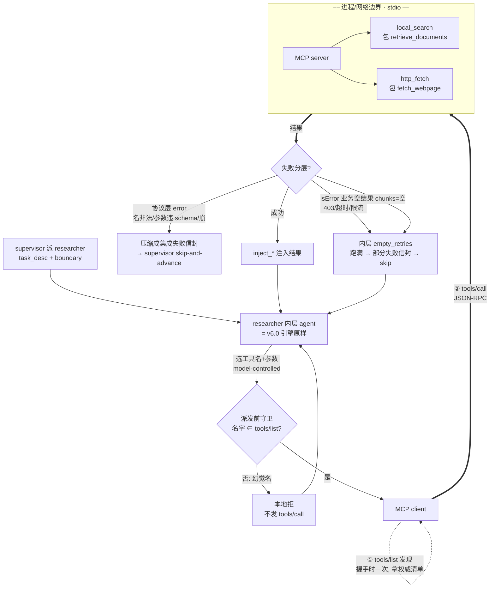

# 第九周设计草稿：researcher 工具层接 MCP

> 状态：**v0.1**（周二设计日初稿，决策 A–G 已锁）。v0.2 将并入周三桩测（E1–En，零 API 验接线），v0.3 将并入周四/周五真实跑。
> 基线：`v6.0`（week_8，supervisor 多 Agent：supervisor/researcher/writer/reviewer）　目标：`v7.0`（researcher 内层工具层从手写注册表升格成"经 MCP client 发现并调用的工具契约"）
> 本文不含实现代码——本文产出的是**决策 + 工具 I/O 契约 + 守卫迁移表 + 两层错误映射 + 状态图**。
> 设计前提：周一《MCP 概念》（主轴"MCP 只管接口层、不碰控制流"；§六 两个问题的答案——控制流归我 loop、幻觉名守卫挪不动；§九 Q1–Q4）。决策 A 已定 **包一层（不重写）**、决策 D 已定 **stdio**。

---

## 〇、本周目标与范围

**roadmap 目标**：MCP 入门——host / client / server、tools / resources 暴露方式、为什么 MCP 对企业集成重要。实战做一个 MCP server 暴露**两个工具**（本地文件搜索 + HTTP API 调用），让 Agent **经 MCP** 调用它们。产出：第一个 MCP 工具服务 + 《MCP 适合接哪些企业系统》。

**范围**：在 v6.0 基线上，把 researcher 内层引擎里的**手写工具注册表**（`retrieve_documents`/`web_search`/`fetch_webpage` 硬编码 + `UnknownTool` 兜底）升格成"**经 MCP client 发现并调用的工具契约**"——新增一个 MCP server（包两个工具）+ 把 MCP client 接进 researcher 的 `agent↔tools↔inject_*` 引擎；v6.0 的 supervisor 拓扑、writer↔reviewer 打回循环、worker 隔离投影、§闸门（`replan_count`/`review_count`/`turn_count`/synthesis-reserve/skip-and-advance）**全部原样复用**。

**关键认识：本周是给工具层插一道进程边界，不是重写引擎，也不动 supervisor 拓扑。** 第八周改的是**角色级控制流**（多 agent 编排），本周改的是**工具接口层**（researcher 内部下一层），两者正交——MCP 不碰 supervisor。真正"新"的只有三块：① MCP server（包两个工具）、② client 接进 researcher 内层、③ 工具表从硬编码换成 `tools/list` 发现来的。理由同第六/七/八周：blast radius 最小，v6.0 刚坐实的隔离投影 / 打回循环 / 双闸门是本周地基，不该再动。

**诚实记一笔（承周一主轴，务必写进《MCP 适合接哪些企业系统》）**：MCP **只标准化接口层**（工具怎么描述/发现/调用 + 失败怎么报成 typed 信号），**不碰控制流**。所以接了 MCP，researcher 的"该搜没搜 / 结果不接地要不要 retry / 失败怎么降级"一条都不会自动变干净——这些仍在我 loop 里（§四、§五）。**故本周 demo 的价值点刻意放在"工具 I/O 契约（§二）+ 守卫迁移（§四）+ 两层错误映射（§五）"**——也就是**拿自己的 demo 验证"框架给原语、控制流自己兜"这条主轴在 MCP 上同样成立**，而非"证明接了 MCP 就更强"。本周 demo 将作为《MCP 适合接哪些企业系统》的论据：接口能被描述成 typed 契约的系统适合 MCP，问题出在控制流的系统、光接 MCP 不解决。

**state schema 诚实记一笔**：本周**不新增 `AgentState` 图级字段**。工具层换接 MCP 是 researcher 内层引擎的内部改动（`tools` 这一环换实现），不穿透到 LangGraph 图状态——这正是"包一层、blast radius 最小"的一个体现。若周三桩测发现需要把"发现来的工具表"或"两层错误类型"显式记进 state，再在 v0.2 补（参照第八周 E5"隔离=显式投影"那种发现型修正）。

---

## 一、接入形态与原语选型（决策 A、B）

### 决策 A — 接入形态：包一层（不重写）✅ 已锁

| 选项 | 落地 | 取舍 | 锁定 |
|---|---|---|---|
| **包一层** | 在现有 `retrieve_documents`/`fetch_webpage` 外套 MCP server，researcher 内层经 client 调 | blast radius 最小；v6.0 引擎/闸门原样复用；"新"只落在进程边界+client+发现 | **✅** |
| 重写工具层 | 借接 MCP 之机重写检索/抓取逻辑 | 能顺手清债，但把"学 MCP"和"重构工具"两件事耦在一起、缺陷难归因 | ✗ |
| 直接用现成 MCP server | 接一个第三方 filesystem/fetch server | 省事但学不到"暴露工具"这一侧（roadmap 明确要求"写一个 server"） | ✗（留对照） |

**选型依据**：本周学习目标是"写一个 server 暴露工具 + Agent 经 MCP 调用"，包一层既满足 roadmap、又把改动锁在工具接口这一刀上，便于把缺陷归因到"MCP 接线"而非"工具逻辑"。延续第八周决策 G"升格不重写"。

**子决策 A′ — Python SDK vs 手搓 JSON-RPC**：用官方 **Python SDK（FastMCP 风格，`@mcp.tool()` 装饰现有函数）**，不手搓 JSON-RPC。理由同 v6.0 手搓 supervisor 的反向取舍——这里**协议层不是学习重点、接口契约才是**，让 SDK 兜传输/JSON-RPC，把精力放在工具描述和 schema 上。（具体装饰器形态周四实现时确认。）

### 决策 B — 原语与工具花名册 ✅ 已锁

| 工具 | 来源（包谁） | owns（负责） | 不碰（边界） |
|---|---|---|---|
| **`local_search`** | 包 `retrieve_documents`（本地 RAG 检索） | 按 query 返回本地库命中 chunk + 引用 | 不抓外网、不做综合 |
| **`http_fetch`** | 包 `fetch_webpage`/`web_search`（HTTP 抓取） | 按 url/query 返回外部页面内容 | 不碰本地库、不做检索排序 |

#### 子决策 B′ — RAG 做成 tool 还是 resource ✅ 已锁（周一 Q4）

**锁 tool，不锁 resource。** 依据三原语的"谁控制"：

| | tool | resource |
|---|---|---|
| 谁控制 | **模型**（model-controlled，主动调） | 应用/host（app-controlled，被动读进上下文） |
| 适合 | 需要**按子任务动态决定查什么、查几次**的检索 | 固定要进上下文的只读数据 |
| 本周 RAG | ✅ researcher 按 `subtask_query` 动态检索、可多次 | ✗ |

**理由**：researcher 的检索是**主动行为**——它要看子任务 query 决定查什么、看 coverage 决定要不要再查一次，这天然是 model-controlled，做成 tool 才对。**诚实记一笔（留 vN 探索）**：Store 里的**长期事实 / 固定文档**（不依赖子任务、每次都该在上下文里的）才是 resource 的甜区；本周不做，但要在《MCP 适合接哪些企业系统》里点明这个 tool/resource 分界——它正是"主动调 vs 被动读"判据的一个实例。

---

## 二、工具 I/O 契约（决策 C，本周核心交付）

这是 roadmap 的"暴露两个工具"落到 typed 契约上的部分，也是周一定的本周价值点。每个工具钉死 **name + description + `inputSchema` + `outputSchema`**（description 写给模型看、要能让模型判断何时调；schema 是 §四守卫迁移和 §五错误分层的依据）。

| 工具 | `inputSchema`（JSON Schema 要点） | `outputSchema` / 返回 |
|---|---|---|
| **`local_search`** | `{ query: string（必填）, top_k?: integer（默认 5） }` | `{ chunks: [{ text: string, citation: string }] }`；命中为空 → `isError:false` 但 chunks=[]（业务层"查无"，不是错误） |
| **`http_fetch`** | `{ url: string（必填，格式 uri）, max_chars?: integer }` | `{ content: string, status: integer }`；抓取失败（403/超时）→ `isError:true`（业务失败，见 §五） |

**description 纪律（对标第八周 rubric 要二元）**：工具 description 要写清"**什么时候该用我、我不干什么**"——`local_search` 写"查本项目/本地库内容时用；不抓外网"，`http_fetch` 写"查外部公开网页时用；不查本地库"。**这是对抗周一缺陷 #5"researcher 把本地题漂成 web 查询"的接口层一道软约束**——但要诚实：description 只是软约束，真正防漂移的语境锚仍在 supervisor 的 `task_description.boundary`（控制流，归我，§五）。

**空结果 vs 失败的区分（钉死，喂 §五）**：`local_search` 查无命中是**正常业务结果**（`isError:false`、chunks 空），由 researcher 内层"空回答重试 `empty_retries`"接管；`http_fetch` 抓取失败是**业务失败**（`isError:true`），同样走内层 retry。两者都**不是**协议层 error——协议层 error 只在"工具名非法/参数不合 schema/server 崩"时出现。这条区分是 §五整张映射表的地基。

---

## 三、传输选型（决策 D）

### 决策 D — 传输：stdio（本机）✅ 已锁

| 传输 | 场景 | 本周 |
|---|---|---|
| **stdio** | 本机、同机进程、标准输入输出管道 | **✅ 周四 demo 用**——调试最省、零网络变量 |
| Streamable HTTP | 远程、多客户端、HTTPS（含 SSE） | ✗ 留企业部署/vN——多并发、可接 OAuth |

**诚实记一笔**：老的 HTTP+SSE 独立传输已被 Streamable HTTP 取代，不实现、不研究。传输不是本周学习重点（接口契约才是），stdio 够用；"企业部署该上 Streamable HTTP"这一点写进《MCP 适合接哪些企业系统》即可，本周 demo 不做。

---

## 四、守卫迁移表（决策 E，喂第十一周工具白名单）

承周一 §六 Q2：接了 MCP，researcher 现有的守卫哪些能挪到 schema 层、哪些挪不动。这是今天最该钉死的一张表——它直接是第十一周工具白名单的草稿。

| v6.0 现有守卫 | 兜什么 | 接 MCP 后落在哪 | 能否前移到发现/schema 期 |
|---|---|---|---|
| `UnknownTool` 兜底 | 模型幻觉出**不存在的工具名** | 改成 **host 派发前守卫**：拿模型选的名字比对发现来的 `tools/list` 清单、不在就本地拒（不发 `tools/call`） | **挪不动到 schema 层**——模型 model-controlled、住在 MCP 上游，名字幻觉只能在 host 派发前拦或撞 server 协议 error；但**比对对象从硬编码表升格成发现来的权威清单** |
| （v6.0 无显式参数校验） | 给真工具传**错参数** | `inputSchema` 校验（client 或 server 侧） | **✅ 真前移到 schema 层**——这是 MCP 唯一实打实把守卫提前的地方 |
| 空回答重试 `empty_retries` | 检索/抓取**空结果或业务失败** | 留在 researcher 内层 loop（读 `isError`/空 chunks 判重试） | ✗ 留 loop——这是控制流，MCP 不接（§五） |

**一句话收口（接周一主轴）**：MCP 实打实前移的只有"**错参数 → schema 层拒**"这一项；"**幻觉名守卫**"换了比对对象但仍是 host 侧控制流；"**重试判据**"完全留在 loop。**第十一周白名单**因此分两层落地：发现期（schema/清单比对，MCP 给材料）+ 执行期（重试/降级判据，自己兜）。

---

## 五、两层错误 → 控制流分层（决策 F，承第三周 Loop Q3 + 第八周决策 H）

承周一 §六 Q1 + Q3：MCP 把失败分成**协议层 error**（JSON-RPC error）和**执行层 `isError`**（业务失败）两类报清楚——这是单 agent / 同质失败信号下分不开、跨两周悬而未决的那个区分，接了 MCP 的 typed 失败信道第一次有素材分开。把这两层映射到 v6.0 内/外层闸门：

| MCP 失败层 | 触发例 | 该不该 retry | 落到哪层闸门 | 恢复路径 |
|---|---|---|---|---|
| **协议层 error** | 工具名非法、参数不合 schema、server 崩 | **不该**（集成坏了，retry 也白搭） | 不进内层重试，**直接上报 supervisor** | 压缩成"本子任务集成失败"信封回传 → supervisor 走 **skip-and-advance**（`replan_count`），不让它穿透成全局崩溃 |
| **执行层 `isError`** | `http_fetch` 403/超时、限流 | **该**（业务失败，可能换源/重试能成） | researcher **内层** `empty_retries` | 内层 retry，跑满仍失败 → 压缩成"本子任务部分失败"信封回传 → supervisor skip-and-advance |
| **空结果**（`isError:false`、chunks 空） | `local_search` 查无命中 | 视情况（换 query 可重试） | researcher 内层空回答重试 | 同上：内层重试，跑满 → 部分失败信封 → skip |

**控制流分层表（v7.0，对标第八周决策 H）**：

| 层 | 闸门 / 机制 | 接 MCP 后兜什么 |
|---|---|---|
| 内层（researcher 内） | `turn_count` + synthesis-reserve + `empty_retries` | `isError` 业务失败 / 空结果的内层重试——单 worker 内部的事 |
| 内层边界（新增判别） | 读 `isError` / JSON-RPC error 分流 | **新增**：按错误层把失败分流到"内层 retry"还是"上报 supervisor"——这是 MCP typed 失败信道买到的唯一新能力 |
| 外层（supervisor 级） | `replan_count`（skip-and-advance）+ `review_count` + recursion guard | 协议层 error 和"内层 retry 跑满"统一收成 skip |

**收口（接周一主轴）**：MCP 给的是"**把失败报成两类 typed 信号**"；"**看到哪类信号走哪条恢复路径**"这张映射表，是我自己设计的控制流——和第八周决策 H 同构（worker 失败压缩回传、不穿透成全局崩溃），只是这次失败信号**自带类型**，分流判别比 v6.0 的同质失败更干净。这正是周一说的"框架连失败长什么样都标了类型，但看到失败做什么始终是我的活"的落地。

---

## 六、client 插点与复用边界（决策 G）

### 决策 G — client 插在 v6.0 哪一刀 + 复用什么 ✅ 已锁

**插点**：researcher 内层 `agent↔tools↔inject_*` 引擎里，**`tools` 这一环**从"硬编码注册表"换成"MCP client"——握手时 `tools/list` 发现一次（拿到权威工具清单），每次工具调用走 `tools/call`，结果经 `inject_*` 注回。**agent 循环本身、inject_* 注入逻辑、外层 supervisor 拓扑全不动。**

| 复用（v6.0 原样） | 新增（v7.0） |
|---|---|
| researcher 内层 agent 循环 + `inject_*` 注入 | MCP server（包 `local_search` + `http_fetch`） |
| supervisor 路由 + 工具式 handoff + `task_description` 四要素 | MCP client（接进 researcher `tools` 环） |
| writer↔reviewer 打回循环 + `review_count`/best-so-far | `tools/list` 发现 + 派发前守卫（比对清单） |
| worker 隔离投影 + Store/RAG 引擎 + `human_review` | `inputSchema` 校验 + 两层错误分流判别（§五） |

**demo scope 诚实记一笔**：MCP 的学习价值**全部落在 researcher 的工具层**——不需要为了学 MCP 把整个 supervisor/writer/reviewer 栈再跑一遍。周四 demo 可以**裁到"researcher 内层 + MCP server"**（甚至用一个精简单 agent 壳子驱动），把 MCP 机制隔离出来验，避免被 v6.0 上层噪声淹没。这与第八周"刻意把价值点放在 handoff 契约本身、而非证明多 agent 更强"是同一种 scope 纪律。

---

## 七、状态图（researcher 内层，v0.1）

只画 researcher 内层那一刀（外层 supervisor 拓扑见第八周设计草稿 §七、本周不动）。重点标出：**进程边界、`tools/list` 发现 vs `tools/call` 调用、派发前守卫、两层错误分流**。

> `inputSchema` 校验发生在 `tools/call` 前后（client/server 侧），图中并入"派发前守卫/协议层 error"一侧：错参数被 schema 拒 = 协议层 error 路径。

---

## 决策定稿表（v0.1，A–G，状态=周二设计日已锁，待周三桩测验证）

| # | 决策点 | 定稿 | 非显然之处 | 待验证（周三桩测） |
|---|---|---|---|---|
| A | 接入形态 | 包一层（不重写）；Python SDK 兜协议 | 把"学 MCP"和"重构工具"解耦，缺陷可归因 | E：包一层后 researcher 引擎/闸门无回归 |
| B | 工具花名册 | `local_search` + `http_fetch`，各 owns 明确 | description 要写"何时调/不干什么"，软约束防漂 | E：两工具经 client 可发现可调 |
| B′ | RAG=tool vs resource | **tool**（model-controlled，主动检索） | resource 是固定只读数据的甜区，本周不做 | （概念决策，无桩测） |
| C | 工具 I/O 契约 | 四字段钉死 + 空结果≠失败的区分 | 空 chunks 是业务结果非错误，喂 §五分层 | E：schema 完整、空结果不误判成 error |
| D | 传输 | stdio（本机）；Streamable HTTP 留 vN | 老 HTTP+SSE 已废弃、不碰 | E：stdio 链路通 |
| E | 守卫迁移 | 错参数→schema 层；幻觉名→派发前守卫；重试→留 loop | 唯一真前移的是"错参数"；幻觉名只换比对对象 | E：幻觉名被派发前守卫拒；错参数被 schema 拒 |
| F | 两层错误映射 | 协议 error→上报 skip；isError/空→内层 retry | 两类失败走不同恢复路径（跨两周悬念结案） | E：注入两类失败，验路由分叉 |
| G | client 插点/复用 | 插 researcher `tools` 环；上层拓扑不动 | demo 可裁到 researcher+server，隔离 MCP 机制 | E：插点不穿透图 state、上层无回归 |

---

## 待验证清单（周三桩测，零 API，每条配对照组）

v0.1 锁的是接线蓝图。照"离线验接线、真实验策略"第一纪律，下面用**桩 server（零 API、返回固定 payload）**隔离验框架机制成不成立。桩 server 不接真实 RAG/HTTP，只回写死结果——这样验的是"MCP 接线/守卫/错误分流"，不掺工具逻辑变量：

1. **工具发现**：client 经 `tools/list` 拿到 `local_search`/`http_fetch` 两工具的 name+schema；对照——工具表变更后 `listChanged` 触发重新拉取。
2. **派发前守卫拒幻觉名**：模型吐一个清单外的名字（如 `edit`）→ 派发前守卫本地拒、不发 `tools/call`；对照——关守卫 → 撞 server 协议层 error（验证两条路径都在，且默认走前者）。
3. **`inputSchema` 拒错参数**：给 `local_search` 传缺 `query`/类型错的参数 → schema 层拒（协议 error）；对照——合规参数正常通过。
4. **两层错误路由分叉**（决策 F 核心）：桩 server 分别注入"协议层 error"和"`isError` 业务失败"两种返回 → 验证前者上报 supervisor 走 skip、后者进内层 `empty_retries`；对照——空结果（chunks=空、`isError:false`）走内层重试而非上报。
5. **空结果≠失败**：`local_search` 桩回空 chunks（`isError:false`）→ 不被误判成 error、由内层重试接管。
6. **包一层无回归**：researcher 接 MCP client 后，v6.0 的 `turn_count`/synthesis-reserve/隔离投影/上层打回循环行为不变（回归对照第八周桩测基线）。

> 周三若桩测挖出"需把发现来的工具表或错误类型显式记进 state"（参照第八周 E5 隔离=显式投影那种发现型修正），在 v0.2 补 state schema 与本表。

---

*v0.1，2026-06-16（周二设计日初稿）。决策 A–G 已锁：A=包一层、B=local_search+http_fetch、B′=RAG 做 tool、C=四字段 I/O 契约、D=stdio、E=守卫两层迁移、F=两层错误映射、G=client 插 researcher tools 环。本文不含实现代码，产出=决策+工具 I/O 契约+守卫迁移表+两层错误映射+状态图。*
*设计前提见《MCP 概念》（周一·概念精读日）；基线见 week_8 `docs/第八周设计草稿.md`（v0.3，supervisor/researcher/writer/reviewer、隔离投影、双闸门、控制流分层决策 H）、week_7（接地软闸门/skip-and-advance/synthesis-reserve）、week_3《Agent Loop 设计笔记》Q3（纠正/降级在哪层生效——本周由决策 F 借 MCP 两层错误信号给出更干净的分流）。证据来源：MCP 官方 spec 2025-11-25（architecture host/client/server、server/tools 的 `tools/list`+`inputSchema`+`outputSchema`+`isError`、transports stdio/Streamable HTTP、两层错误模型协议 error vs 执行 isError），辅以当前生态（官方 Python SDK / FastMCP、2026-07-28 RC 方向）。下一站：周三桩测验证待验证清单 6 条 → v0.2。*
